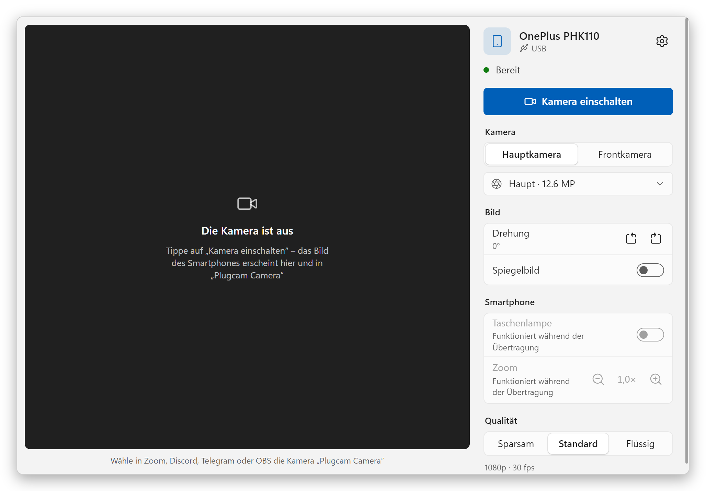

  

<h1 align="center">Plugcam</h1>

  <b>Dein Android-Smartphone als Webcam für Windows.</b> 
  Ein Kabel, ein Knopf. Keine App auf dem Smartphone, keine Wasserzeichen, kostenlos und Open Source.

  <a href="../../README.md">English</a> ·
  <a href="README.ru.md">Русский</a> ·
  <b>Deutsch</b> ·
  <a href="README.es.md">Español</a> ·
  <a href="README.fr.md">Français</a> ·
  <a href="README.pt-BR.md">Português</a> ·
  <a href="README.zh-CN.md">简体中文</a> ·
  <a href="README.ja.md">日本語</a>

  

## Warum Plugcam

- **Nichts auf dem Smartphone installieren.** Plugcam spricht per USB-Debugging mit dem Smartphone und startet dort für die Dauer der Übertragung den Kamerateil von [scrcpy](https://github.com/Genymobile/scrcpy).
- **Eine echte Webcam für Windows.** „Plugcam Camera“ erscheint neben deinen anderen Kameras in Programmen und Browsern, die DirectShow nutzen: Zoom, Discord, Telegram Desktop, OBS, Chrome, Edge, Firefox – und damit auch in Webanrufen wie Google Meet.
- **Gutes Bild.** Bis zu 1080p mit 30 fps, auf geeigneten Smartphones 60 fps. Das Smartphone kodiert H.264 per Hardware, der PC merkt kaum etwas.
- **Alle Regler, die man erwartet.** Haupt- oder Frontkamera und jedes Objektiv, Zoom mit 1×/2×/5×, Taschenlampe, Drehung für ein hochkant stehendes Smartphone, Spiegelbild.
- **Dauerhaft kostenlos.** Keine Wasserzeichen, kein Zeitlimit, kein Konto, keine Telemetrie. Apache-2.0.
- **Spricht deine Sprache.** 13 Sprachen, darunter Deutsch.

## Loslegen

1. **Installieren.** Lade `Plugcam_x.y.z_x64-setup.exe` aus dem [neuesten Release](https://github.com/Qwinty/plugcam/releases/latest) und starte sie. Windows fragt einmal nach Administratorrechten, um die Kamera zu registrieren.
2. **USB-Debugging einschalten**: *Einstellungen → Über das Telefon*, siebenmal auf *Build-Nummer* tippen, dann *Einstellungen → System → Entwickleroptionen → USB-Debugging*. Die Ersteinrichtung von Plugcam führt dich hindurch.
3. **Smartphone anschließen**, dort auf *Zulassen* tippen und **Kamera einschalten** drücken. Wähle in deiner Video-App **Plugcam Camera**.

Der Installer ist noch nicht signiert, daher meldet SmartScreen eventuell „Der Computer wurde durch Windows geschützt“. Klicke auf *Weitere Informationen → Trotzdem ausführen* oder prüfe die Datei mit der `.sha256` daneben im Release.

## Screenshots

<table>
  <tr>
    <td></td>
    <td></td>
  </tr>
  <tr>
    <td align="center">Dunkles Design wie Windows · Русский</td>
    <td align="center">Einstellungen · Deutsch</td>
  </tr>
  <tr>
    <td></td>
    <td></td>
  </tr>
  <tr>
    <td align="center">Ersteinrichtung · 日本語</td>
    <td align="center">Bereit · Español</td>
  </tr>
  <tr>
    <td></td>
    <td></td>
  </tr>
  <tr>
    <td align="center">Einstellungen, dunkel · 简体中文</td>
    <td align="center">Ersteinrichtung · Français</td>
  </tr>
</table>

## Voraussetzungen

- Windows 10 oder 11, 64-Bit.
- Ein Smartphone mit Android 12 oder neuer (für die Kameraaufnahme nötig) und ein USB-Kabel, das Daten überträgt.
- Den USB-Treiber liefert meist Windows Update. Wird das Smartphone nicht gefunden, installiere den [Google-USB-Treiber](https://developer.android.com/studio/run/win-usb) oder den Treiber des Herstellers.

## Gut zu wissen

- **Apps aus dem Microsoft Store**, etwa die Windows-Kamera-App, sehen Plugcam Camera nicht: Sie ist eine DirectShow-Kamera, wie sie klassische Programme und Browser nutzen. Eine Media-Foundation-Kamera für Store-Apps ist geplant.
- **WLAN** gibt es noch nicht, es ist als Nächstes dran.
- **Manche Objektive liefern kein Bild.** Smartphones listen Objektive, die sie an Drittprogramme nicht streamen. Plugcam merkt das, blendet das Objektiv aus und wechselt zur Hauptkamera.
- **Kein Ton.** Nutze das Mikrofon des PCs oder ein Headset.
- Plugcam wurde mit einem OnePlus 11R (Android 15) und Chrome entwickelt und getestet. Andere Smartphones und Apps sollten genauso funktionieren; wenn nicht, [eröffne bitte ein Issue](https://github.com/Qwinty/plugcam/issues) mit Smartphone-Modell und App.

Funktionsweise, Bauen aus dem Quellcode und Lizenzen: siehe [englisches README](../../README.md).

## Datenschutz

Plugcam hat keine Server und sendet nichts. Das Video geht per Kabel vom Smartphone zum PC und bleibt dort.

Lizenz: [Apache-2.0](../../LICENSE). Komponenten von Dritten: [THIRD_PARTY_NOTICES.md](../../THIRD_PARTY_NOTICES.md).
