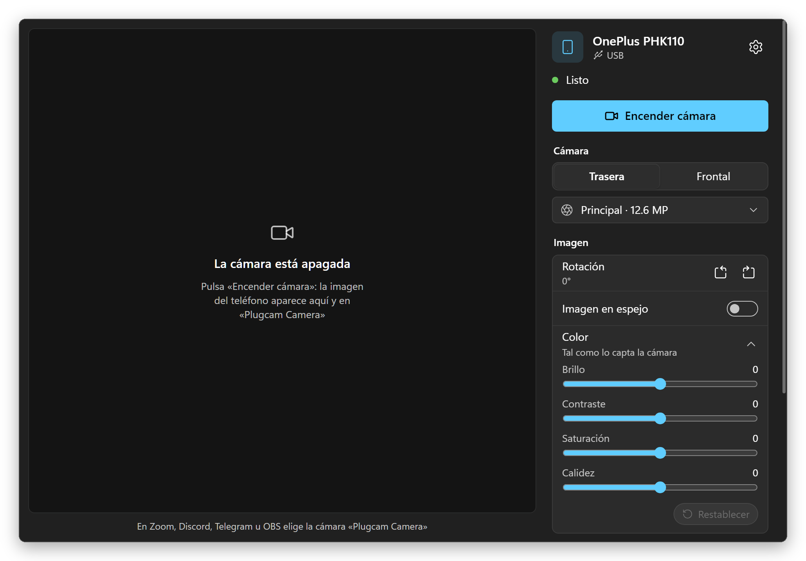
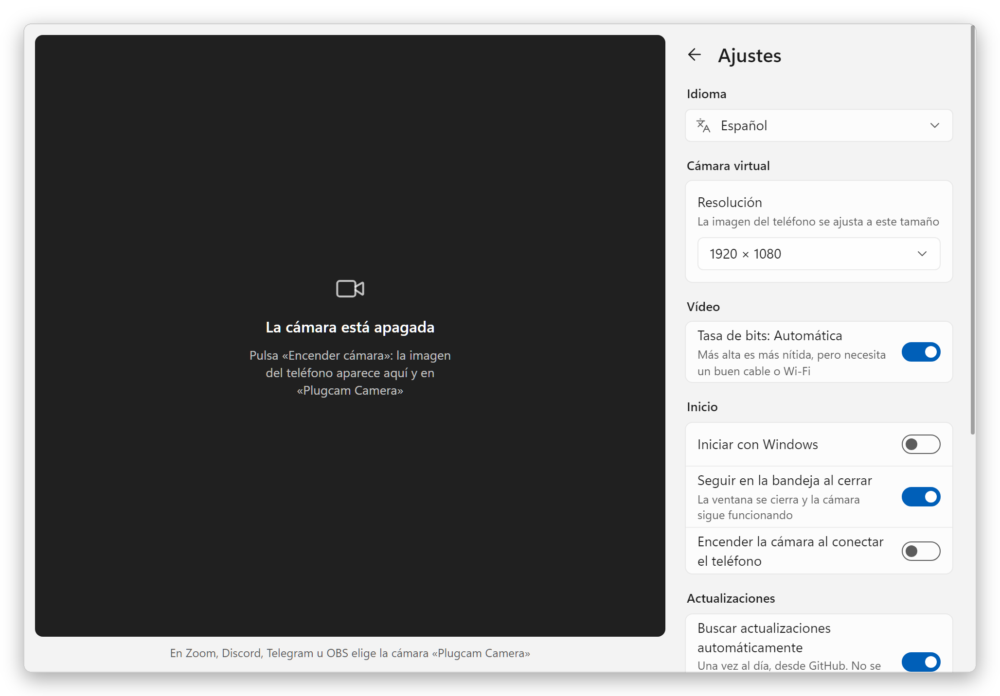
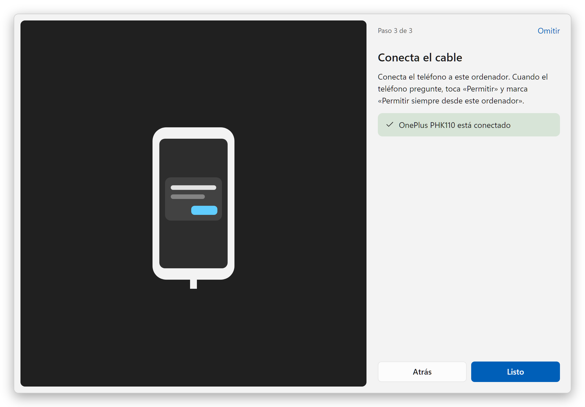
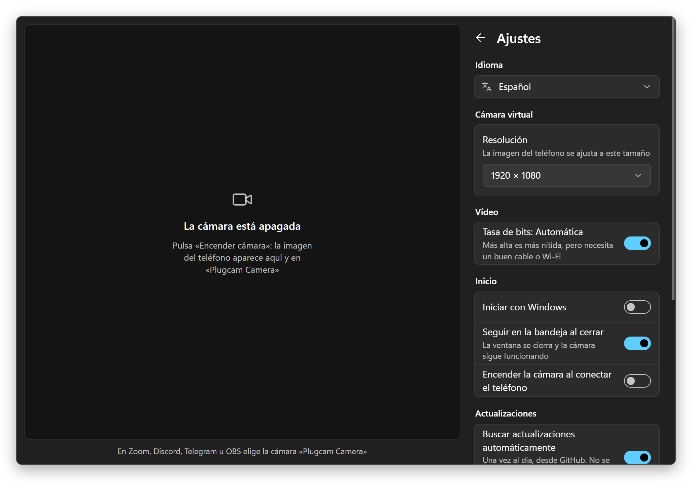

  

<h1 align="center">Plugcam</h1>

  <b>Tu teléfono Android como webcam para Windows.</b> 
  Un cable, un botón. Sin app en el teléfono, sin OBS, sin marcas de agua. 
  Una alternativa gratis y de código abierto a DroidCam, Iriun e iVCam.

  <a href="../../README.md">English</a> ·
  <a href="README.ru.md">Русский</a> ·
  <a href="README.de.md">Deutsch</a> ·
  <b>Español</b> ·
  <a href="README.fr.md">Français</a> ·
  <a href="README.pt-BR.md">Português</a> ·
  <a href="README.zh-CN.md">简体中文</a> ·
  <a href="README.ja.md">日本語</a>

  

## Por qué Plugcam

- **No hay que instalar nada en el teléfono.** Plugcam habla con el teléfono mediante la depuración USB y ejecuta en él la parte de cámara de [scrcpy](https://github.com/Genymobile/scrcpy) mientras transmites.
- **Una webcam de verdad para Windows.** «Plugcam Camera» aparece junto a tus otras cámaras en los programas y navegadores que usan DirectShow: Zoom, Discord, Telegram Desktop, OBS, Chrome, Edge, Firefox y, por tanto, también en llamadas web como Google Meet.
- **Buena imagen.** Hasta 4K, si la cámara del teléfono lo capta, a 30 fps, o 60 fps en teléfonos compatibles. El teléfono codifica H.264 por hardware y el chip gráfico del PC lo decodifica, así que el PC apenas lo nota.
- **Todos los controles que esperas.** Cámara trasera o frontal y cada lente, zoom con 1×/2×/5×, linterna, rotación para un teléfono en vertical, imagen en espejo, y brillo, contraste, saturación y calidez.
- **Gratis para siempre.** Sin marcas de agua, sin límite de tiempo, sin cuenta, sin telemetría. Apache-2.0.
- **Ligero.** Una descarga de 7,4 MB. En la bandeja ocupa 7 MB de memoria; transmitiendo desde ahí, menos del 1 % de la CPU. Las actualizaciones se instalan solas con un clic.
- **Habla tu idioma.** 13 idiomas, incluido el español.

## Comparación

Las apps que la gente suele probar primero, a septiembre de 2026. Los planes gratuitos cambian a menudo, así que cada nombre enlaza a la página del propio fabricante.

| | Plugcam | [DroidCam](https://droidcam.app/) | [Iriun](https://iriun.com/) | [iVCam](https://www.e2esoft.com/ivcam/) | [Camo](https://camo.com/pricing) | [Phone Link](https://support.microsoft.com/en-us/windows/apps/phonelink/use-your-mobile-device-s-camera) |
|---|---|---|---|---|---|---|
| App en el teléfono | **ninguna** | sí | sí | sí | sí | Link to Windows |
| Imagen gratis | **hasta 4K, 30 o 60 fps** | 640×480; HD con marca de agua | hasta 4K, con marca de agua | marca de agua; 640×480 tras la prueba | hasta 720p | 720p |
| Anuncios | **no** | sí | sí | sí | no | no |
| Conexión | USB | USB, Wi-Fi | USB, Wi-Fi | USB, Wi-Fi | USB, Wi-Fi | Wi-Fi + Bluetooth |
| Código abierto | **sí, Apache-2.0** | solo el cliente de PC | no | no | no | no |
| Descarga para Windows | **7,4 MB** | 98 MB | 8,8 MB, necesita .NET Desktop Runtime | unos 43 MB | unos 475 MB | incluido en Windows 11 |

Dos opciones sin app que quizá ya tengas: los teléfonos con Android 14 o posterior pueden funcionar por sí solos como webcam USB si el fabricante activó ese modo (los Pixel lo hacen), y [scrcpy](https://github.com/Genymobile/scrcpy), en el que se basa Plugcam, muestra la cámara en una ventana (en Windows necesitas OBS para convertir esa ventana en una webcam). Lo que aún le falta a Plugcam frente a las apps de pago: Wi-Fi y sonido.

### Otros proyectos de código abierto

De todos ellos, solo Plugcam le da a Windows una webcam sin instalar nada en el teléfono y sin OBS de por medio. Los demás tienen cosas que Plugcam no tiene: Wi-Fi, compatibilidad con versiones más antiguas de Android o (BestCam) una cámara que ven las apps de Microsoft Store. Comprobado con el README de cada proyecto en septiembre de 2026. scrcpy, en el que se basa Plugcam, se usa desde la línea de comandos; Plugcam convierte su modo de cámara en una app con vista previa y controles.

| | Plugcam | [VCamdroid](https://github.com/darusc/VCamdroid) | [Android Webcam Project](https://github.com/soubhagyajit/Android-Webcam-Project) | [BestCam](https://github.com/OneLimeStudio/BestCam) (alfa) | [scrcpy](https://github.com/Genymobile/scrcpy) |
|---|---|---|---|---|---|
| App en el teléfono | ninguna | sí | sí | sí | ninguna |
| Webcam en Windows | sí, DirectShow | sí, DirectShow | sí | sí, Media Foundation (Windows 11 22H2+) | a través de OBS u otra herramienta de captura de ventanas; webcam en Linux |
| Conexión | USB | USB, Wi-Fi | USB, Wi-Fi | USB | USB, Wi-Fi |
| Android | 12+ | 7.0+ | 8.0+ | 8.0+ | 12+ para la cámara |
| En el PC | app con vista previa, controles y guía de primer uso | app | app | script de Python; app anunciada | línea de comandos; la ventana solo muestra el vídeo |
| Instalación | instalador o zip portátil; se actualiza solo | zip y luego install.bat como administrador | instalador | zip, sin instalador | zip o winget |
| Licencia | Apache-2.0 | MIT | GPL-3.0 | GPL-2.0 | Apache-2.0 |

### Ligero para tu PC

Plugcam es una app nativa en Rust con una pequeña cámara virtual en C++. La ventana la dibuja el WebView2 que viene con Windows (a través de [Tauri](https://tauri.app)), así que no incluye su propio Chromium como las apps de Electron. El vídeo en sí nunca pasa por la página web: la decodificación (con el decodificador H.264 del propio Windows, en el chip gráfico), la rotación, el escalado, los ajustes de color y la entrega de fotogramas a la cámara ocurren en Rust, y la ventana solo recibe una pequeña vista previa mientras está abierta. El WebView dibuja sin el chip gráfico, lo que ahorra unos 80 MB en una ventana tan sencilla. Al cerrarse a la bandeja, Plugcam apaga el WebView por completo, así que una cámara funcionando en segundo plano usa menos del 1 % de la CPU.

Medido en un portátil con Ryzen 7 8845HS y Windows 11, contando Plugcam y todos sus procesos de WebView2, con la media de un minuto tomada con [`scripts/measure.ps1`](../../scripts/measure.ps1):

| | Memoria | CPU |
|---|---|---|
| En la bandeja | **7 MB** | 0 % |
| Ventana abierta, cámara apagada | 83 MB | 0 % |
| Transmitiendo 1080p30, en la bandeja | 99 MB | **0,6 %** |
| Transmitiendo 1080p30, ventana abierta con vista previa | 204 MB | 4,4 % |

La memoria es lo que muestra la columna «Memoria» del «Administrador de tareas» (el conjunto de trabajo privado), así que puedes compararla ahí con cualquier otra app. La CPU es la parte de los 16 hilos del procesador de 8 núcleos, también como en el Administrador de tareas. La transmisión se midió con un OnePlus 11R a 1080p y 30 fps. La imagen se decodifica en la Radeon 780M integrada en el procesador; su memoria de vídeo es RAM normal, así que los búferes de fotogramas del decodificador cuentan en la columna de memoria.

adb, a través del cual Plugcam habla con el teléfono, añade unos 2 MB; lo comparte con cualquier otra herramienta de Android que uses.

## Primeros pasos

1. **Instala.** Descarga `Plugcam_x.y.z_x64-setup.exe` de la [última versión](https://github.com/Qwinty/plugcam/releases/latest) y ejecútalo. Windows pide permisos de administrador una vez, para registrar la cámara. Después, Plugcam aparece en el menú Inicio. ¿Prefieres no instalarlo? Toma `Plugcam_x.y.z_x64-portable.zip`, descomprímelo donde quieras y ejecuta `Plugcam.exe`; en el primer inicio pide permisos de administrador una vez, para añadir la cámara.
2. **Activa la depuración USB** en el teléfono: *Ajustes → Información del teléfono*, toca siete veces *Número de compilación* y luego *Ajustes → Sistema → Opciones para desarrolladores → Depuración USB*. La guía inicial de Plugcam te acompaña.
3. **Conecta el teléfono**, toca *Permitir* en él y pulsa **Encender cámara**. En tu app de vídeo, elige **Plugcam Camera**.

El instalador aún no está firmado, así que SmartScreen puede decir «Windows protegió su PC». Haz clic en *Más información → Ejecutar de todas formas*, o comprueba el archivo con el `.sha256` que lo acompaña en la versión.

**Las actualizaciones llegan solas.** Plugcam busca una versión nueva una vez al día; cuando la hay, aparece un botón *Actualizar*. Con un clic la descarga, comprueba su firma, la instala y reinicia Plugcam, que después muestra qué ha cambiado. Así se actualizan tanto la versión instalada como la portable, y puedes desactivar la comprobación diaria en Ajustes.

## Capturas

<table>
  <tr>
    <td></td>
    <td></td>
  </tr>
  <tr>
    <td align="center">Tema oscuro como Windows</td>
    <td align="center">Ajustes</td>
  </tr>
  <tr>
    <td></td>
    <td></td>
  </tr>
  <tr>
    <td align="center">Guía inicial</td>
    <td align="center">Ajustes, tema oscuro</td>
  </tr>
</table>

## Requisitos

- Windows 10 u 11 de 64 bits.
- Un teléfono con Android 12 o posterior (necesario para capturar la cámara) y un cable USB que transmita datos.
- El controlador USB suele llegar por Windows Update. Si no se encuentra el teléfono, instala el [controlador USB de Google](https://developer.android.com/studio/run/win-usb) o el del fabricante.

## Preguntas frecuentes

### ¿Cómo usar mi móvil Android como webcam en Windows sin instalar ninguna app en el móvil?

Eso es justo lo que hace Plugcam. Mientras transmites, ejecuta en el teléfono la parte de cámara de scrcpy mediante la depuración USB, y la quita cuando paras. No se instala ningún APK y el teléfono no necesita root, solo Android 12 o posterior. Los teléfonos con Android 14 o posterior quizá tengan además un modo de webcam USB integrado, si el fabricante lo activó (los Pixel lo tienen).

### ¿Hay alguna alternativa gratis y de código abierto a DroidCam, Iriun o iVCam?

Plugcam es una. Es de código abierto con licencia Apache-2.0 y da hasta 4K a 30 fps, o 60 fps en teléfonos compatibles, sin marca de agua, anuncios, límite de tiempo ni cuenta. Lo que esas apps tienen y Plugcam aún no: Wi-Fi y sonido. Consulta la [Comparación](#comparación).

### ¿Qué apps pueden usar Plugcam Camera?

Los programas y navegadores que usan cámaras DirectShow: Zoom, Discord, Telegram Desktop, OBS, Chrome, Edge y Firefox, así que también funcionan las llamadas desde el navegador, como Google Meet. Las apps de Microsoft Store, como la app Cámara de Windows, no la ven; está prevista una cámara Media Foundation para ellas. Microsoft Teams aún no se ha probado.

### ¿Hace falta OBS?

No. Plugcam registra su propia cámara, así que los programas de vídeo la ven directamente. Con scrcpy a secas en Windows tendrías que capturar su ventana en OBS e iniciar la cámara virtual de OBS.

### ¿Plugcam funciona por Wi-Fi?

Todavía no, solo con cable USB. Wi-Fi es lo siguiente.

### ¿Plugcam transmite el sonido?

No, Plugcam solo envía la imagen. Usa el micrófono del PC o unos auriculares.

### ¿Plugcam funciona con iPhone, o en macOS o Linux?

No, Plugcam necesita un teléfono Android y Windows. En Linux, el propio scrcpy puede convertir el teléfono en una webcam: carga el módulo `v4l2loopback` y ejecuta `scrcpy --video-source=camera --v4l2-sink=/dev/videoN --no-video-playback`. En un Mac con iPhone, la Cámara de Continuidad viene incluida.

### ¿Con qué móviles Android funciona Plugcam?

Plugcam necesita Android 12 o posterior, porque scrcpy solo puede capturar la cámara a partir de Android 12. Se hizo y se probó con un OnePlus 11R (Android 15) y Chrome; otros teléfonos deberían funcionar igual. Algunos teléfonos listan lentes que no transmiten a apps de terceros; Plugcam lo detecta, oculta esa lente y cambia a la cámara principal. Si tu teléfono o tu app no funciona, [abre un issue](https://github.com/Qwinty/plugcam/issues) con el modelo del teléfono y la app.

Cómo funciona, cómo compilarlo y las licencias: en el [README en inglés](../../README.md).

## Privacidad

Plugcam no tiene servidores y no envía nada a ninguna parte. El vídeo va del teléfono al PC por el cable y se queda ahí. Lo único que descarga de internet es la lista de versiones en GitHub, una vez al día, para ver si hay una actualización (se puede desactivar en Ajustes). Los ajustes son un archivo JSON en `%APPDATA%\io.github.plugcam`, o en la carpeta `data` de la versión portable.

Licencia: [Apache-2.0](../../LICENSE). Componentes de terceros: [THIRD_PARTY_NOTICES.md](../../THIRD_PARTY_NOTICES.md).
