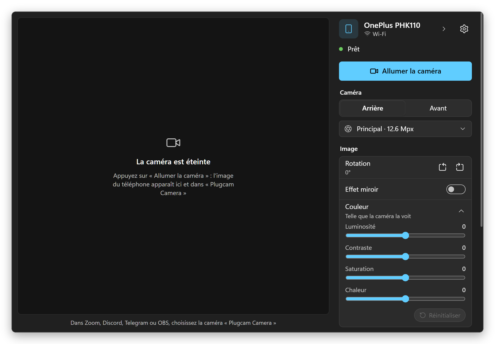
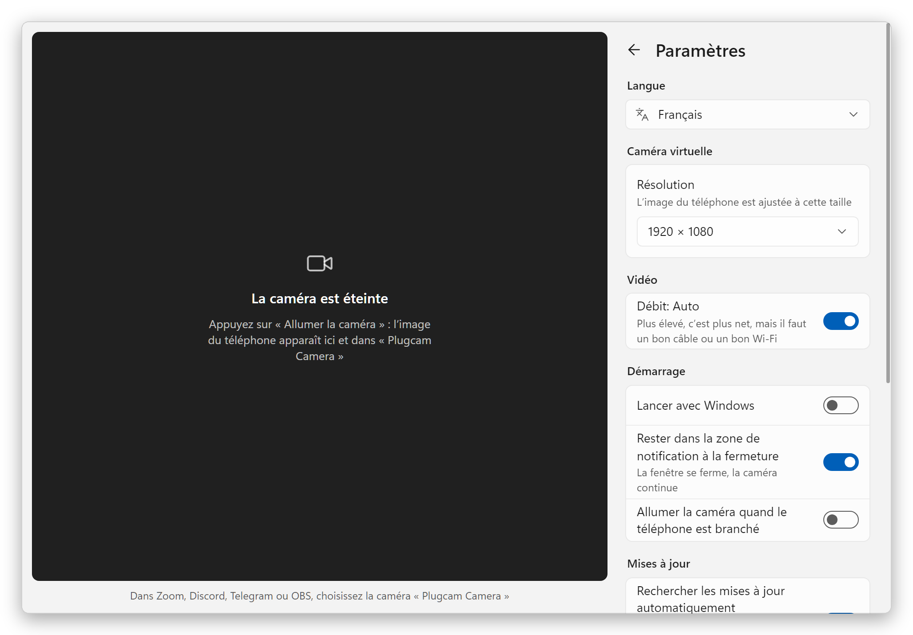
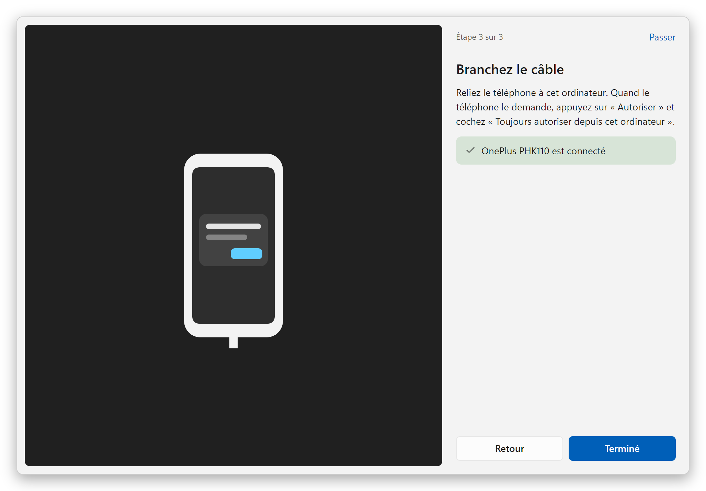
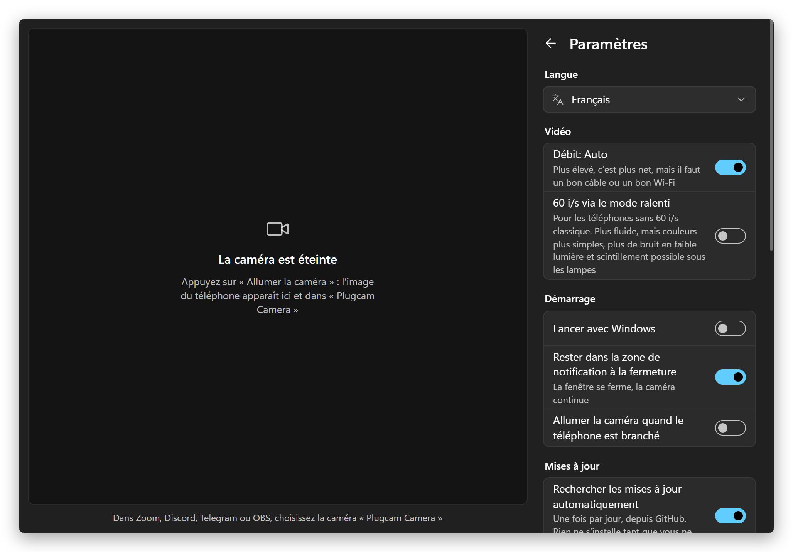

  

<h1 align="center">Plugcam</h1>

  <b>Votre téléphone Android comme webcam pour Windows.</b> 
  Un câble, un bouton. Aucune appli sur le téléphone, pas d’OBS, pas de filigrane. 
  Une alternative gratuite et open source à DroidCam, Iriun et iVCam.

  <a href="../../README.md">English</a> ·
  <a href="README.ru.md">Русский</a> ·
  <a href="README.de.md">Deutsch</a> ·
  <a href="README.es.md">Español</a> ·
  <b>Français</b> ·
  <a href="README.pt-BR.md">Português</a> ·
  <a href="README.zh-CN.md">简体中文</a> ·
  <a href="README.ja.md">日本語</a>

  

## Pourquoi Plugcam

- **Rien à installer sur le téléphone.** Plugcam communique avec le téléphone via le débogage USB et y lance la partie caméra de [scrcpy](https://github.com/Genymobile/scrcpy) le temps de la diffusion.
- **Une vraie webcam pour Windows.** « Plugcam Camera » apparaît à côté de vos autres caméras dans les logiciels et navigateurs qui utilisent DirectShow : Zoom, Discord, Telegram Desktop, OBS, Chrome, Edge, Firefox, et donc aussi dans les appels web comme Google Meet.
- **Une bonne image.** Jusqu’à la 4K si la caméra du téléphone la capte, à 30 i/s, ou 60 i/s sur les téléphones compatibles. Le téléphone encode en H.264 matériel et la puce graphique du PC décode, le PC ne sent presque rien.
- **Tous les réglages attendus.** Caméra arrière ou avant et chaque objectif, zoom avec 1×/2×/5×, lampe torche, rotation pour un téléphone posé à la verticale, effet miroir, ainsi que luminosité, contraste, saturation et chaleur.
- **Gratuit pour de bon.** Pas de filigrane, pas de limite de durée, pas de compte, pas de télémétrie. Apache-2.0.
- **Léger.** Un téléchargement de 7,4 Mo. Dans la zone de notification, il occupe 7 Mo de mémoire ; en diffusant depuis là, moins de 1 % du processeur. Les mises à jour s’installent d’elles-mêmes en un clic.
- **Parle votre langue.** 13 langues, dont le français.

## Comparaison

Les applis que l’on essaie d’habitude en premier, en septembre 2026. Les offres gratuites changent souvent, chaque nom renvoie donc à la page de l’éditeur.

| | Plugcam | [DroidCam](https://droidcam.app/) | [Iriun](https://iriun.com/) | [iVCam](https://www.e2esoft.com/ivcam/) | [Camo](https://camo.com/pricing) | [Phone Link](https://support.microsoft.com/en-us/windows/apps/phonelink/use-your-mobile-device-s-camera) |
|---|---|---|---|---|---|---|
| Appli sur le téléphone | **aucune** | oui | oui | oui | oui | Link to Windows |
| Image gratuite | **jusqu’à 4K, 30 ou 60 i/s** | 640×480 ; filigrane en HD | jusqu’à 4K, avec filigrane | filigrane ; 640×480 après l’essai | jusqu’à 720p | 720p |
| Publicité | **aucune** | oui | oui | oui | aucune | aucune |
| Connexion | USB | USB, Wi-Fi | USB, Wi-Fi | USB, Wi-Fi | USB, Wi-Fi | Wi-Fi + Bluetooth |
| Open source | **oui, Apache-2.0** | client PC seulement | non | non | non | non |
| Téléchargement Windows | **7,4 Mo** | 98 Mo | 8,8 Mo, nécessite .NET Desktop Runtime | environ 43 Mo | environ 475 Mo | intégré à Windows 11 |

Deux options sans appli que vous avez peut-être déjà : les téléphones sous Android 14 ou plus récent peuvent servir eux-mêmes de webcam USB si le fabricant a activé ce mode (c’est le cas des Pixel), et [scrcpy](https://github.com/Genymobile/scrcpy), sur lequel Plugcam s’appuie, affiche la caméra dans une fenêtre (sous Windows, il faut OBS pour faire de cette fenêtre une webcam). Ce qui manque encore à Plugcam face aux applis payantes : le Wi-Fi et le son.

### Autres projets open source

Parmi eux, seul Plugcam offre une webcam à Windows sans rien installer sur le téléphone ni passer par OBS. Les autres ont des choses que Plugcam n’a pas : le Wi-Fi, la prise en charge d’anciennes versions d’Android ou (pour BestCam) une caméra visible par les applis du Microsoft Store. Vérifié d’après le README de chaque projet en septembre 2026. scrcpy, sur lequel repose Plugcam, s’utilise en ligne de commande, et Plugcam fait de son mode caméra une appli avec aperçu et réglages.

| | Plugcam | [VCamdroid](https://github.com/darusc/VCamdroid) | [Android Webcam Project](https://github.com/soubhagyajit/Android-Webcam-Project) | [BestCam](https://github.com/OneLimeStudio/BestCam) (alpha) | [scrcpy](https://github.com/Genymobile/scrcpy) |
|---|---|---|---|---|---|
| Appli sur le téléphone | aucune | oui | oui | oui | aucune |
| Webcam sous Windows | oui, DirectShow | oui, DirectShow | oui | oui, Media Foundation (Windows 11 22H2+) | via OBS ou un autre outil de capture de fenêtre ; une webcam sous Linux |
| Connexion | USB | USB, Wi-Fi | USB, Wi-Fi | USB | USB, Wi-Fi |
| Android | 12+ | 7.0+ | 8.0+ | 8.0+ | 12+ pour la caméra |
| Sur le PC | appli avec aperçu, réglages et guide de démarrage | appli | appli | script Python, appli annoncée | ligne de commande, la fenêtre n’affiche que la vidéo |
| Installation | installateur ou zip portable, se met à jour tout seul | zip, puis install.bat en administrateur | installateur | zip, sans installateur | zip ou winget |
| Licence | Apache-2.0 | MIT | GPL-3.0 | GPL-2.0 | Apache-2.0 |

### Léger pour votre PC

Plugcam est une appli native en Rust avec une petite caméra virtuelle en C++. La fenêtre est dessinée par le WebView2 fourni avec Windows (via [Tauri](https://tauri.app)), il n’y a donc pas de Chromium embarqué comme dans les applis Electron. La vidéo elle-même ne passe jamais par la page web : le décodage (avec le décodeur H.264 de Windows, sur la puce graphique), la rotation, la mise à l’échelle, les réglages de couleur et la remise des images à la caméra se font en Rust, et la fenêtre ne reçoit qu’un petit aperçu tant qu’elle est ouverte. Le WebView dessine sans la puce graphique, ce qui économise environ 80 Mo pour une fenêtre aussi simple. Fermé dans la zone de notification, Plugcam arrête complètement le WebView : une caméra qui tourne en arrière-plan utilise moins de 1 % du processeur.

Mesuré sur un portable Ryzen 7 8845HS sous Windows 11, en comptant Plugcam et tous ses processus WebView2, en moyenne sur une minute avec [`scripts/measure.ps1`](../../scripts/measure.ps1) :

| | Mémoire | CPU |
|---|---|---|
| Dans la zone de notification | **7 Mo** | 0 % |
| Fenêtre ouverte, caméra éteinte | 83 Mo | 0 % |
| Diffusion 1080p30, dans la zone de notification | 99 Mo | **0,6 %** |
| Diffusion 1080p30, fenêtre ouverte avec aperçu | 204 Mo | 4,4 % |

La mémoire est ce qu’affiche la colonne « Mémoire » du « Gestionnaire des tâches » (la plage de travail privée) : vous pouvez donc la comparer là avec n’importe quelle autre appli. Le processeur est compté sur ses 16 threads (8 cœurs), comme dans le Gestionnaire des tâches. La diffusion a été mesurée avec un OnePlus 11R en 1080p à 30 i/s. L’image est décodée par la Radeon 780M intégrée au processeur ; sa mémoire vidéo est de la RAM ordinaire, donc les tampons d’images du décodeur comptent dans la colonne mémoire.

adb, par lequel Plugcam communique avec le téléphone, ajoute environ 2 Mo ; il est partagé avec les autres outils Android que vous utilisez.

## Démarrer

1. **Installez.** Téléchargez `Plugcam_x.y.z_x64-setup.exe` depuis la [dernière version](https://github.com/Qwinty/plugcam/releases/latest) et lancez-le. Windows demande une fois les droits d’administrateur, pour enregistrer la caméra. Plugcam apparaît ensuite dans le menu Démarrer. Vous préférez ne pas installer ? Prenez `Plugcam_x.y.z_x64-portable.zip`, extrayez-le où vous voulez et lancez `Plugcam.exe` ; au premier démarrage, il demande une fois les droits d’administrateur, pour ajouter la caméra.
2. **Activez le débogage USB** sur le téléphone : *Paramètres → À propos du téléphone*, appuyez sept fois sur *Numéro de build*, puis *Paramètres → Système → Options pour les développeurs → Débogage USB*. Le guide de démarrage de Plugcam vous accompagne.
3. **Branchez le téléphone**, appuyez sur *Autoriser* dessus puis sur **Allumer la caméra**. Dans votre appli vidéo, choisissez **Plugcam Camera**.

L’installateur n’est pas encore signé, SmartScreen peut donc afficher « Windows a protégé votre ordinateur ». Cliquez sur *Informations complémentaires → Exécuter quand même*, ou vérifiez le fichier avec le `.sha256` fourni dans la version.

**Les mises à jour arrivent toutes seules.** Plugcam cherche une nouvelle version une fois par jour ; s’il y en a une, un bouton *Mise à jour* apparaît. Un clic la télécharge, vérifie sa signature, l’installe et redémarre Plugcam, qui montre ensuite ce qui a changé. La version installée comme la version portable se mettent à jour ainsi, et vous pouvez désactiver la vérification quotidienne dans les Paramètres.

## Captures d’écran

<table>
  <tr>
    <td></td>
    <td></td>
  </tr>
  <tr>
    <td align="center">Thème sombre comme Windows</td>
    <td align="center">Paramètres</td>
  </tr>
  <tr>
    <td></td>
    <td></td>
  </tr>
  <tr>
    <td align="center">Guide de démarrage</td>
    <td align="center">Paramètres, thème sombre</td>
  </tr>
</table>

## Configuration requise

- Windows 10 ou 11, 64 bits.
- Un téléphone sous Android 12 ou plus récent (nécessaire pour capturer la caméra) et un câble USB qui transmet les données.
- Le pilote USB arrive en général par Windows Update. Si le téléphone n’est pas trouvé, installez le [pilote USB de Google](https://developer.android.com/studio/run/win-usb) ou celui du fabricant.

## Questions fréquentes

### Peut-on utiliser son téléphone Android comme webcam sur Windows sans installer d’appli dessus ?

Oui, c’est ce que fait Plugcam. Il lance la partie caméra de scrcpy sur le téléphone via le débogage USB le temps de la diffusion, et la retire quand vous arrêtez. Aucun APK n’est installé, et le téléphone n’a pas besoin d’être rooté, seulement d’Android 12 ou plus récent. Les téléphones sous Android 14 ou plus récent peuvent aussi avoir un mode webcam USB intégré, si le fabricant l’a activé (c’est le cas des Pixel).

### Existe-t-il une alternative gratuite et open source à DroidCam, Iriun ou iVCam ?

Plugcam en est une. Il est open source sous Apache-2.0 et offre jusqu’à la 4K à 30 i/s, ou 60 i/s sur les téléphones compatibles, sans filigrane, publicité, limite de durée ni compte. Ce que ces applis ont et que Plugcam n’a pas encore : le Wi-Fi et le son. Voir la [comparaison](#comparaison).

### Quelles applis peuvent utiliser Plugcam Camera ?

Les logiciels et navigateurs qui utilisent les caméras DirectShow : Zoom, Discord, Telegram Desktop, OBS, Chrome, Edge et Firefox, donc les appels dans le navigateur comme Google Meet fonctionnent aussi. Les applis du Microsoft Store, comme l’appli Caméra de Windows, ne la voient pas ; une caméra Media Foundation pour elles est prévue. Microsoft Teams n’a pas encore été testé.

### Est-ce qu’il faut OBS ?

Non. Plugcam enregistre sa propre caméra, les logiciels de visio la voient donc directement. Avec scrcpy seul sous Windows, il faudrait capturer sa fenêtre dans OBS et lancer la caméra virtuelle d’OBS.

### Est-ce que Plugcam marche en Wi-Fi ?

Pas encore, seulement avec un câble USB. Le Wi-Fi est la prochaine étape.

### Est-ce que Plugcam transmet le son ?

Non, Plugcam n’envoie que l’image. Utilisez le micro du PC ou un casque.

### Est-ce que Plugcam marche avec un iPhone, sur Mac ou sous Linux ?

Non, Plugcam a besoin d’un téléphone Android et de Windows. Sous Linux, scrcpy lui-même peut faire du téléphone une webcam : chargez le module `v4l2loopback` et lancez `scrcpy --video-source=camera --v4l2-sink=/dev/videoN --no-video-playback`. Sur un Mac avec un iPhone, la Caméra de continuité est intégrée.

### Quels téléphones Android sont compatibles avec Plugcam ?

Plugcam nécessite Android 12 ou plus récent, car scrcpy ne peut capturer la caméra qu’à partir d’Android 12. Il a été développé et testé avec un OnePlus 11R (Android 15) et Chrome ; les autres téléphones devraient fonctionner de la même façon. Certains téléphones listent des objectifs qu’ils ne diffusent pas aux applis tierces ; Plugcam s’en aperçoit, masque l’objectif et passe à la caméra principale. Si votre téléphone ou votre appli ne fonctionne pas, [ouvrez une issue](https://github.com/Qwinty/plugcam/issues) en indiquant le modèle du téléphone et l’appli. Dans Plugcam, **Paramètres → Diagnostic → Enregistrer le rapport** crée un fichier à y joindre.

Fonctionnement, compilation et licences : voir le [README en anglais](../../README.md).

## Confidentialité

Plugcam n’a pas de serveur et n’envoie rien nulle part. La vidéo passe du téléphone au PC par le câble et y reste. La seule chose qu’il récupère sur Internet, c’est la liste des versions sur GitHub, une fois par jour, pour savoir s’il existe une mise à jour (désactivable dans les Paramètres). Les paramètres sont un fichier JSON dans `%APPDATA%\io.github.plugcam`, ou dans le dossier `data` de la version portable.

Licence : [Apache-2.0](../../LICENSE). Composants tiers : [THIRD_PARTY_NOTICES.md](../../THIRD_PARTY_NOTICES.md).
