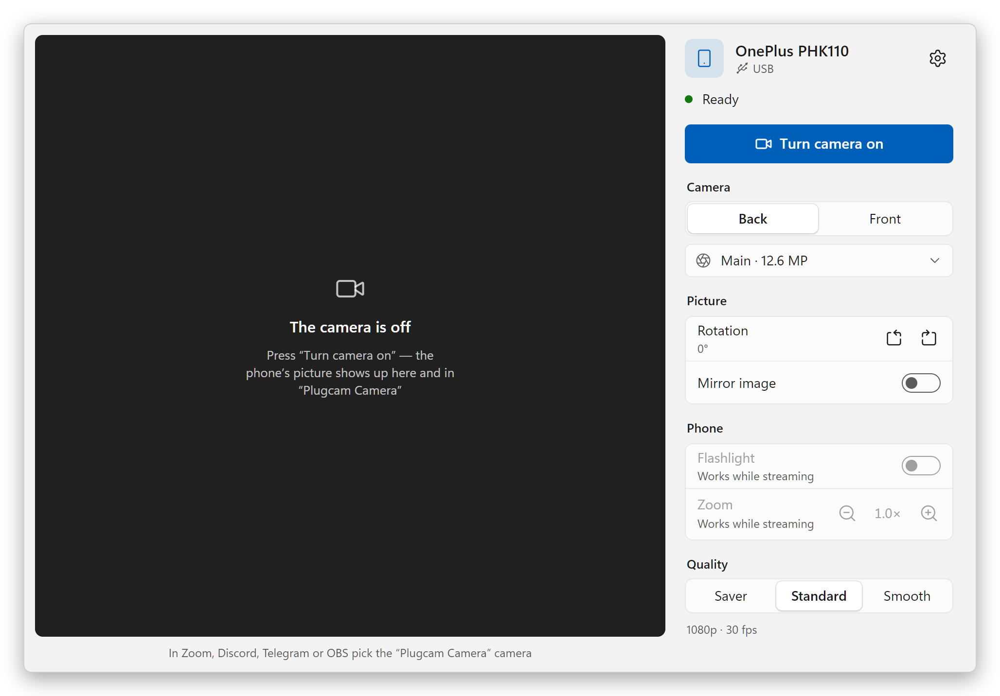
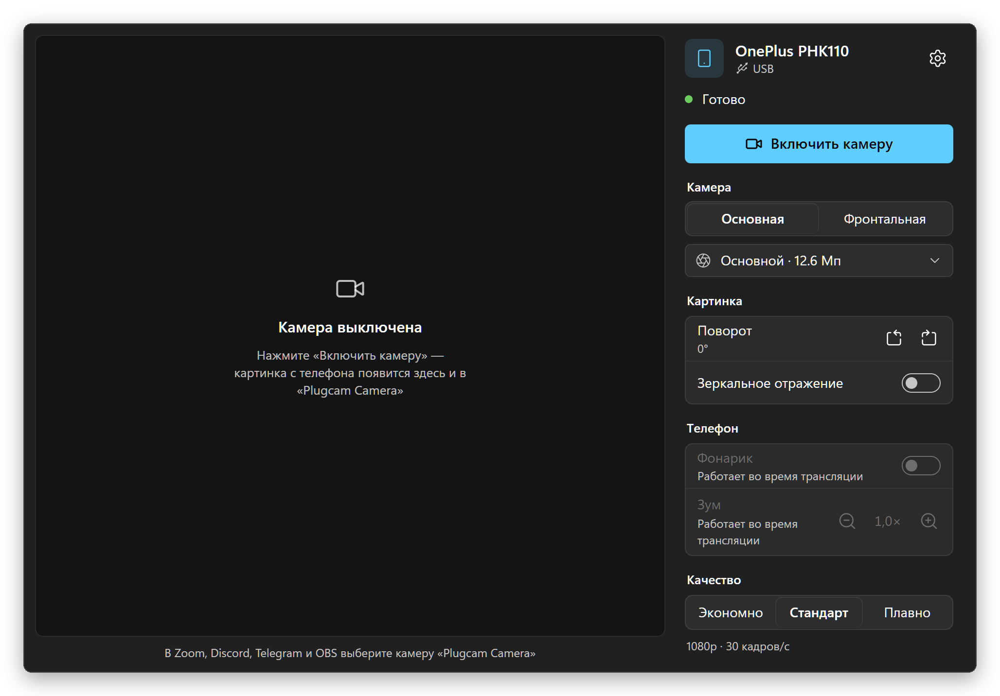
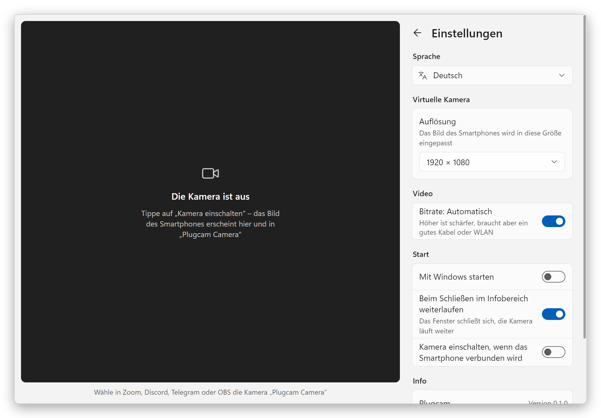
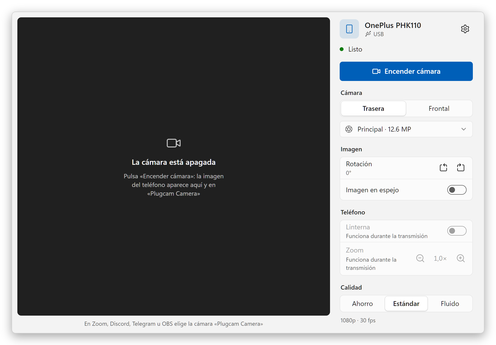
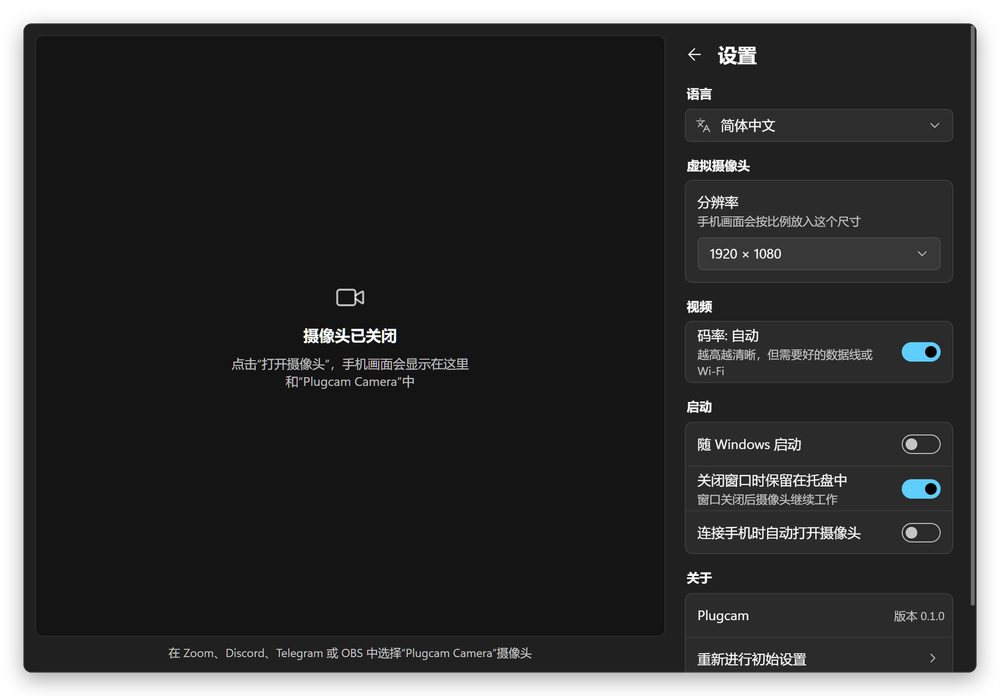
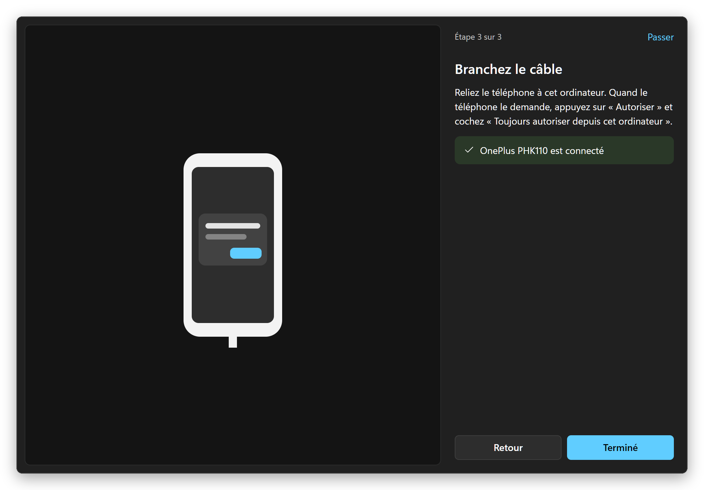

  

<h1 align="center">Plugcam</h1>

  <b>Votre téléphone Android comme webcam pour Windows.</b> 
  Un câble, un bouton. Aucune appli sur le téléphone, pas de filigrane, gratuit et open source.

  <a href="../../README.md">English</a> ·
  <a href="README.ru.md">Русский</a> ·
  <a href="README.de.md">Deutsch</a> ·
  <a href="README.es.md">Español</a> ·
  <b>Français</b> ·
  <a href="README.pt-BR.md">Português</a> ·
  <a href="README.zh-CN.md">简体中文</a> ·
  <a href="README.ja.md">日本語</a>

  

## Pourquoi Plugcam

- **Rien à installer sur le téléphone.** Plugcam communique avec le téléphone via le débogage USB et y lance la partie caméra de [scrcpy](https://github.com/Genymobile/scrcpy) le temps de la diffusion.
- **Une vraie webcam pour Windows.** « Plugcam Camera » apparaît à côté de vos autres caméras dans les logiciels et navigateurs qui utilisent DirectShow : Zoom, Discord, Telegram Desktop, OBS, Chrome, Edge, Firefox, et donc aussi dans les appels web comme Google Meet.
- **Une bonne image.** Jusqu’à 1080p à 30 i/s, ou 60 i/s sur les téléphones compatibles. Le téléphone encode en H.264 matériel, le PC ne sent presque rien.
- **Tous les réglages attendus.** Caméra arrière ou avant et chaque objectif, zoom avec 1×/2×/5×, lampe torche, rotation pour un téléphone posé à la verticale, effet miroir.
- **Gratuit pour de bon.** Pas de filigrane, pas de limite de durée, pas de compte, pas de télémétrie. Apache-2.0.
- **Parle votre langue.** 13 langues, dont le français.

## Démarrer

1. **Installez.** Téléchargez `Plugcam_x.y.z_x64-setup.exe` depuis la [dernière version](https://github.com/Qwinty/plugcam/releases/latest) et lancez-le. Windows demande une fois les droits d’administrateur, pour enregistrer la caméra.
2. **Activez le débogage USB** sur le téléphone : *Paramètres → À propos du téléphone*, appuyez sept fois sur *Numéro de build*, puis *Paramètres → Système → Options pour les développeurs → Débogage USB*. Le guide de démarrage de Plugcam vous accompagne.
3. **Branchez le téléphone**, appuyez sur *Autoriser* dessus puis sur **Allumer la caméra**. Dans votre appli vidéo, choisissez **Plugcam Camera**.

L’installateur n’est pas encore signé, SmartScreen peut donc afficher « Windows a protégé votre ordinateur ». Cliquez sur *Informations complémentaires → Exécuter quand même*, ou vérifiez le fichier avec le `.sha256` fourni dans la version.

## Captures d’écran

<table>
  <tr>
    <td></td>
    <td></td>
  </tr>
  <tr>
    <td align="center">Thème sombre comme Windows · Русский</td>
    <td align="center">Paramètres · Deutsch</td>
  </tr>
  <tr>
    <td></td>
    <td></td>
  </tr>
  <tr>
    <td align="center">Guide de démarrage · 日本語</td>
    <td align="center">Prêt à diffuser · Español</td>
  </tr>
  <tr>
    <td></td>
    <td></td>
  </tr>
  <tr>
    <td align="center">Paramètres, thème sombre · 简体中文</td>
    <td align="center">Guide de démarrage · Français</td>
  </tr>
</table>

## Configuration requise

- Windows 10 ou 11, 64 bits.
- Un téléphone sous Android 12 ou plus récent (nécessaire pour capturer la caméra) et un câble USB qui transmet les données.
- Le pilote USB arrive en général par Windows Update. Si le téléphone n’est pas trouvé, installez le [pilote USB de Google](https://developer.android.com/studio/run/win-usb) ou celui du fabricant.

## Bon à savoir

- **Les applis du Microsoft Store**, comme l’appli Caméra de Windows, ne voient pas Plugcam Camera : c’est une caméra DirectShow, celle qu’utilisent les logiciels classiques et les navigateurs. Une caméra Media Foundation pour les applis du Store est prévue.
- **Le Wi-Fi** n’est pas encore là ; c’est la prochaine étape.
- **Certains objectifs ne donnent pas d’image.** Les téléphones listent des objectifs qu’ils ne diffusent pas aux applis tierces. Plugcam s’en aperçoit, masque l’objectif et passe à la caméra principale.
- **Pas de son.** Utilisez le micro du PC ou un casque.
- Plugcam a été développé et testé avec un OnePlus 11R (Android 15) et Chrome. Les autres téléphones et applis devraient fonctionner de la même façon ; sinon, [ouvrez une issue](https://github.com/Qwinty/plugcam/issues) en indiquant le modèle du téléphone et l’appli.

Fonctionnement, compilation et licences : voir le [README en anglais](../../README.md).

## Confidentialité

Plugcam n’a pas de serveur et n’envoie rien nulle part. La vidéo passe du téléphone au PC par le câble et y reste.

Licence : [Apache-2.0](../../LICENSE). Composants tiers : [THIRD_PARTY_NOTICES.md](../../THIRD_PARTY_NOTICES.md).
