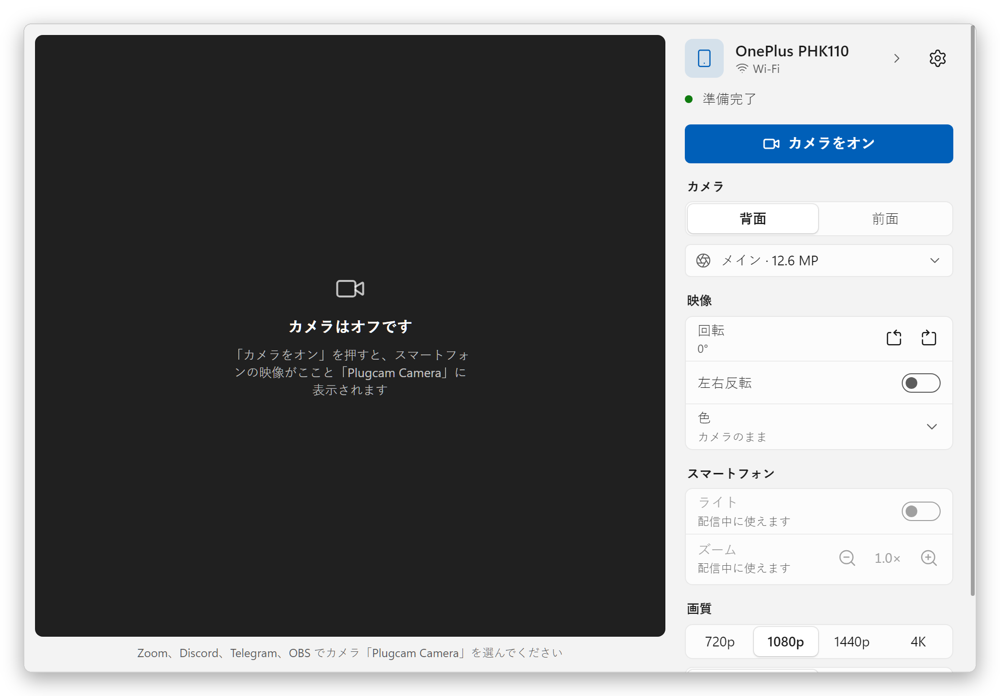
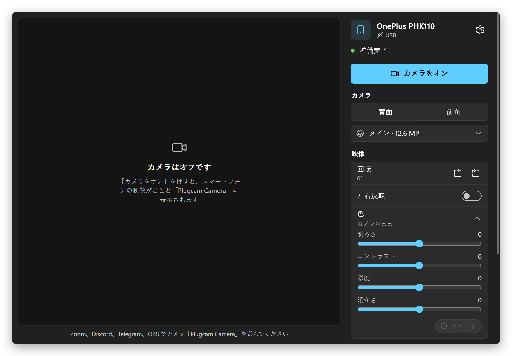
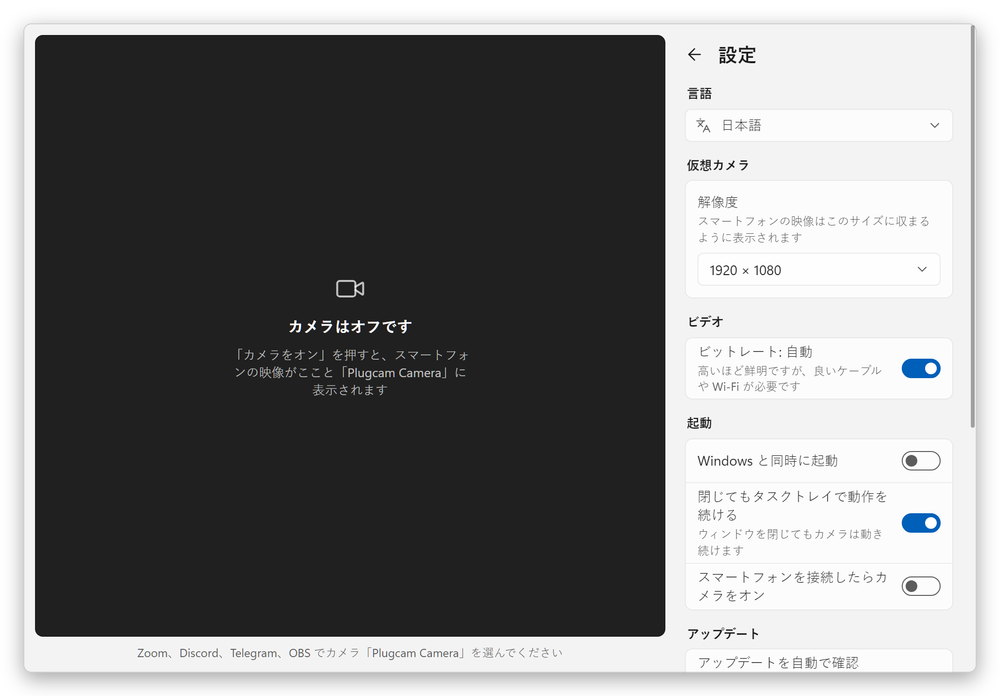
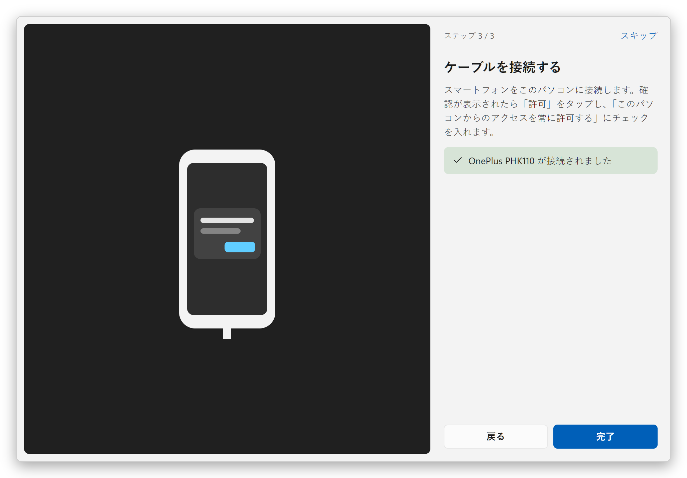
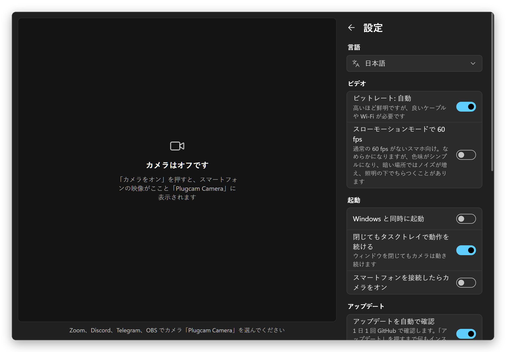

  

<h1 align="center">Plugcam</h1>

  <b>Android スマートフォンを Windows の Web カメラに。</b> 
  USB でも Wi-Fi でも、ボタン 1 つ。スマートフォンにアプリは不要、OBS も透かしもなし。 
  DroidCam、Iriun、iVCam の代わりに使える、無料のオープンソース アプリです。

  <a href="../../README.md">English</a> ·
  <a href="README.ru.md">Русский</a> ·
  <a href="README.de.md">Deutsch</a> ·
  <a href="README.es.md">Español</a> ·
  <a href="README.fr.md">Français</a> ·
  <a href="README.pt-BR.md">Português</a> ·
  <a href="README.zh-CN.md">简体中文</a> ·
  <b>日本語</b>

  

## Plugcam の特長

- **スマートフォンに何もインストールしません。** Plugcam は USB デバッグでスマートフォンとやり取りし、配信中だけ [scrcpy](https://github.com/Genymobile/scrcpy) のカメラ部分をスマートフォンで動かします。
- **USB でも Wi-Fi でも使えます。** QR コードか 6 桁のコードで一度ペア設定するか、ケーブル接続中のスマートフォンをワンクリックで Wi-Fi に切り替えます。その後は、ネットワーク上にあれば自動で接続します。ネットワークが一瞬途切れても Plugcam が再接続し、その間アプリには最後の映像が表示されたままです。
- **Windows の本物の Web カメラ。** 「Plugcam Camera」は、DirectShow を使うアプリやブラウザで他のカメラと並んで表示されます。Zoom、Discord、Telegram Desktop、OBS、Chrome、Edge、Firefox、そして Google Meet などの Web 通話でも使えます。
- **きれいな映像。** 最大 4K（スマートフォンのカメラが撮影できる範囲で）・30 fps、対応機種なら 60 fps。H.264 のエンコードはスマートフォンのハードウェアが、デコードは PC のグラフィックスチップが行うので、PC の負荷はわずかです。
- **必要な操作はそろっています。** 背面・前面カメラと各レンズの切り替え、1×/2×/5× のズーム、ライト、縦置き用の回転、左右反転、明るさ・コントラスト・彩度・暖かさの調整。
- **ずっと無料。** 透かし、時間制限、アカウント、テレメトリはありません。Apache-2.0 ライセンス。
- **軽量。** ダウンロードは 7.2 MB。タスクトレイで待機中のメモリ使用量は 7 MB、そのまま配信しても CPU 使用率は 1% 未満です。アップデートはワンクリックで自動的にインストールされます。
- **多言語対応。** 日本語を含む 13 言語。

## 他のアプリとの比較

多くの人が最初に試すアプリです（2026 年 9 月時点）。無料プランはよく変わるため、各名前は開発元のページにリンクしています。

| | Plugcam | [DroidCam](https://droidcam.app/) | [Iriun](https://iriun.com/) | [iVCam](https://www.e2esoft.com/ivcam/) | [Camo](https://camo.com/pricing) | [Phone Link](https://support.microsoft.com/en-us/windows/apps/phonelink/use-your-mobile-device-s-camera) |
|---|---|---|---|---|---|---|
| スマートフォンのアプリ | **不要** | 必要 | 必要 | 必要 | 必要 | Link to Windows |
| 無料版の映像 | **最大 4K、30 または 60 fps** | 640×480、HD は透かし入り | 最大 4K、透かし入り | 透かし入り、試用期間後は 640×480 | 最大 720p | 720p |
| 広告 | **なし** | あり | あり | あり | なし | なし |
| 接続 | **USB、Wi-Fi** | USB、Wi-Fi | USB、Wi-Fi | USB、Wi-Fi | USB、Wi-Fi | Wi-Fi + Bluetooth |
| オープンソース | **はい、Apache-2.0** | PC 版クライアントのみ | いいえ | いいえ | いいえ | いいえ |
| Windows 版のダウンロード | **7.2 MB** | 98 MB | 8.8 MB、.NET Desktop Runtime が必要 | 約 43 MB | 約 475 MB | Windows 11 に標準搭載 |

アプリなしで使える方法が、すでに手元にあるかもしれません。Android 14 以降のスマートフォンは、メーカーがそのモードを有効にしていれば単体で USB Web カメラとして使えます（Pixel は対応）。また、Plugcam のベースである [scrcpy](https://github.com/Genymobile/scrcpy) はカメラ映像をウィンドウに表示できます（Windows でそのウィンドウを Web カメラにするには OBS が必要です）。有料アプリと比べて Plugcam にまだ足りないのは、音声です。

### 他のオープンソース プロジェクト

この中で、スマートフォンに何もインストールせず、間に OBS も挟まずに Windows に Web カメラを追加できるのは Plugcam だけです。ほかのプロジェクトには、古い Android への対応、（BestCam では）Microsoft Store のアプリからも見えるカメラなど、Plugcam にない機能があります。2026 年 9 月に各プロジェクトの README で確認しました。Plugcam のベースである scrcpy はコマンドラインのツールで、Plugcam はそのカメラ機能をプレビューとコントロール付きのアプリにしています。

| | Plugcam | [VCamdroid](https://github.com/darusc/VCamdroid) | [Android Webcam Project](https://github.com/soubhagyajit/Android-Webcam-Project) | [BestCam](https://github.com/OneLimeStudio/BestCam)（アルファ版） | [scrcpy](https://github.com/Genymobile/scrcpy) |
|---|---|---|---|---|---|
| スマートフォンのアプリ | 不要 | 必要 | 必要 | 必要 | 不要 |
| Windows の Web カメラ | 対応、DirectShow | 対応、DirectShow | 対応 | 対応、Media Foundation（Windows 11 22H2 以降） | OBS などのウィンドウ キャプチャ ツール経由。Linux では Web カメラになる |
| 接続 | USB、Wi-Fi | USB、Wi-Fi | USB、Wi-Fi | USB | USB、Wi-Fi |
| Android | 12 以降 | 7.0 以降 | 8.0 以降 | 8.0 以降 | カメラは 12 以降 |
| PC 側 | プレビュー、各種コントロール、初期設定ガイド付きのアプリ | アプリ | アプリ | Python スクリプト（アプリは公開予定） | コマンドライン（ウィンドウには映像のみ） |
| インストール | インストーラーまたはポータブル版 zip、自動アップデート | zip を展開し、install.bat を管理者として実行 | インストーラー | zip（インストーラーなし） | zip または winget |
| ライセンス | Apache-2.0 | MIT | GPL-3.0 | GPL-2.0 | Apache-2.0 |

### PC に軽い

Plugcam は、小さな C++ 製の仮想カメラを備えたネイティブの Rust アプリです。ウィンドウは Windows に付属する WebView2 で描画するため（[Tauri](https://tauri.app) 経由）、Electron アプリのように Chromium を同梱していません。映像そのものは Web ページを通りません。デコード（Windows 標準の H.264 デコーダーで、グラフィックスチップ上で実行）、回転、拡大縮小、色の調整、カメラへのフレームの受け渡しはすべて Rust で行い、ウィンドウには開いている間だけ小さなプレビューを送ります。WebView はグラフィックスチップを使わずに描画するので、これほど単純なウィンドウでは約 80 MB の節約になります。タスクトレイに閉じると Plugcam は WebView を完全に終了するので、バックグラウンドで動くカメラの CPU 使用率は 1% 未満です。

Ryzen 7 8845HS 搭載の Windows 11 ノート PC で、Plugcam とそのすべての WebView2 プロセスを合計し、[`scripts/measure.ps1`](../../scripts/measure.ps1) で 1 分間の平均を測定しました。

| | メモリ | CPU |
|---|---|---|
| タスクトレイ | **7 MB** | 0% |
| ウィンドウ表示中、カメラはオフ | 83 MB | 0% |
| 1080p30 で配信中、タスクトレイ | 99 MB | **0.6%** |
| 1080p30 で配信中、ウィンドウ表示・プレビューあり | 204 MB | 4.4% |

メモリは「タスク マネージャー」の「メモリ」列に表示される値（プライベート ワーキング セット）なので、そこで他のアプリと比べられます。CPU は 8 コア CPU の全 16 スレッドに対する割合で、これもタスク マネージャーと同じです。配信は OnePlus 11R で 1080p・30 fps で測定しました。映像のデコードは CPU 内蔵の Radeon 780M が行います。そのビデオメモリは通常の RAM なので、デコーダーのフレームバッファーもメモリの列に含まれます。

Plugcam がスマートフォンとの通信に使う adb がさらに約 2 MB 使いますが、これは他に実行している Android ツールと共有されます。

## 使い方

1. **インストール。** [最新リリース](https://github.com/Qwinty/plugcam/releases/latest)から `Plugcam_x.y.z_x64-setup.exe` をダウンロードして実行します。カメラを登録するため、Windows が一度だけ管理者権限を求めます。インストール後、Plugcam はスタート メニューに表示されます。インストールしたくない場合は、`Plugcam_x.y.z_x64-portable.zip` を好きな場所に展開して `Plugcam.exe` を実行してください。初回起動時に、カメラを追加するため一度だけ管理者権限を求めます。
2. **スマートフォンで USB デバッグをオン**にします。*設定 → デバイス情報* で *ビルド番号* を 7 回タップし、*設定 → システム → 開発者向けオプション → USB デバッグ* をオンにします。Plugcam の初期設定ガイドが順に案内します。
3. **スマートフォンを接続**し、スマートフォンで *許可* をタップしてから **カメラをオン** を押します。ビデオ通話アプリで **Plugcam Camera** を選びます。
4. **ケーブルなしで使いたい場合**は、サイドパネルの *スマートフォンと Wi-Fi* を開き、QR コードかペア設定コード（*開発者向けオプション → ワイヤレス デバッグ*）でスマートフォンをペア設定します。ケーブルでつないでいるうちに *ケーブルから* を押す方法もあります。スマートフォンと PC は同じネットワークに接続している必要があります。

インストーラーはまだコード署名されていないため、SmartScreen が「Windows によって PC が保護されました」と表示することがあります。*詳細情報 → 実行* をクリックするか、リリースに添付された `.sha256` でファイルを確認してください。

**アップデートは自動で届きます。** Plugcam は 1 日 1 回新しいバージョンを確認し、見つかると *更新* ボタンが表示されます。クリック 1 回でダウンロード、署名の確認、インストール、Plugcam の再起動まで行い、再起動後に変更点を表示します。インストール版もポータブル版も同じ方法でアップデートされ、毎日の確認は設定でオフにできます。

## スクリーンショット

<table>
  <tr>
    <td></td>
    <td></td>
  </tr>
  <tr>
    <td align="center">Windows に合わせたダークテーマ</td>
    <td align="center">設定</td>
  </tr>
  <tr>
    <td></td>
    <td></td>
  </tr>
  <tr>
    <td align="center">初期設定ガイド</td>
    <td align="center">設定（ダークテーマ）</td>
  </tr>
</table>

## 動作環境

- Windows 10 または 11（64 ビット）。
- Android 12 以降のスマートフォン（カメラの取り込みに必要）と、データ通信ができる USB ケーブル、または PC と同じ Wi-Fi ネットワーク。
- スマートフォンの USB ドライバは通常 Windows Update で入ります。スマートフォンが見つからない場合は、[Google USB ドライバ](https://developer.android.com/studio/run/win-usb) かメーカーのドライバをインストールしてください。

## よくある質問

### スマホにアプリを入れずに Android を Windows の Web カメラにできますか？

はい、それが Plugcam の役割です。配信中だけ USB デバッグでスマートフォン上に scrcpy のカメラ部分を起動し、配信を止めると削除します。APK はインストールせず、root 化も不要で、必要なのは Android 12 以降だけです。Android 14 以降のスマートフォンには、メーカーが有効にしていれば USB Web カメラ モードが標準で備わっていることもあります（Pixel は対応）。

### DroidCam、Iriun、iVCam の代わりになる無料のオープンソース アプリはありますか？

Plugcam がその 1 つです。Apache-2.0 のオープンソースで、最大 4K・30 fps（対応機種なら 60 fps）の映像を USB でも Wi-Fi でも、透かし、広告、時間制限、アカウントなしで使えます。これらのアプリにあって Plugcam にまだないのは、音声です。詳しくは[他のアプリとの比較](#他のアプリとの比較)をご覧ください。

### Plugcam Camera はどのアプリで使えますか？

DirectShow カメラを使うデスクトップ アプリとブラウザです。Zoom、Discord、Telegram Desktop、OBS、Chrome、Edge、Firefox で使えます。ブラウザで使えるので、Google Meet などのブラウザ通話でも使えます。Microsoft Store のアプリ（Windows のカメラ アプリなど）からは見えません。これらのアプリ向けの Media Foundation カメラを予定しています。Microsoft Teams での動作はまだ確認していません。

### OBS は必要ですか？

いいえ。Plugcam は独自のカメラを登録するので、デスクトップのビデオ アプリから直接見えます。Windows で scrcpy だけを使う場合は、そのウィンドウを OBS でキャプチャし、OBS の仮想カメラを起動する必要があります。

### Plugcam は Wi-Fi でも使えますか？

はい、バージョン 0.2.0 から使えます。*スマートフォンと Wi-Fi* を開き、*開発者向けオプション → ワイヤレス デバッグ* に表示される QR コードか 6 桁のコードで一度ペア設定するか、*ケーブルから* を押してケーブル接続中のスマートフォンを Wi-Fi に切り替えます。ペア設定済みのスマートフォンは、ネットワーク上に現れると自動で接続されます。Wi-Fi 経由でも映像の遅れは約 0.5 秒を超えません。Plugcam は遅延をためずに最新の映像まで一気に進め、ネットワークが追いつかないときはビットレートを下げます。

### Plugcam で音声も送れますか？

いいえ、Plugcam が送るのは映像だけです。PC のマイクやヘッドセットをお使いください。

### Plugcam は iPhone や Mac、Linux でも使えますか？

いいえ、Plugcam には Android スマートフォンと Windows が必要です。Linux では scrcpy 自体でスマートフォンを Web カメラにできます。`v4l2loopback` モジュールを読み込んで `scrcpy --video-source=camera --v4l2-sink=/dev/videoN --no-video-playback` を実行してください。Mac と iPhone の組み合わせなら、連係カメラが標準で使えます。

### Plugcam に対応している Android スマホは？

Plugcam には Android 12 以降が必要です。scrcpy がカメラを取り込めるのは Android 12 からだからです。OnePlus 11R（Android 15）と Chrome で開発・テストしましたが、他のスマートフォンでも同じように動くはずです。スマートフォンによっては、他社アプリには映像を出さないレンズも一覧に含めます。Plugcam はそれを検出してそのレンズを隠し、メインカメラに切り替えます。お使いのスマートフォンやアプリで動かない場合は、機種名とアプリ名を添えて [issue を作成](https://github.com/Qwinty/plugcam/issues)してください。Plugcam の **設定 → 診断 → レポートを保存** で、添付用のファイルを作れます。

仕組み、ソースからのビルド、ライセンスについては[英語の README](../../README.md) をご覧ください。

## プライバシー

Plugcam にはサーバーがなく、どこにも何も送信しません。映像はケーブルまたはローカルネットワーク経由でスマートフォンから PC に届き、PC の中だけにとどまります。インターネットから取得するのは、アップデートの有無を確かめるための GitHub のリリース一覧だけで、それも 1 日 1 回です（設定でオフにできます）。設定は `%APPDATA%\io.github.plugcam` の JSON ファイルに、ポータブル版では `data` フォルダーに保存されます。

ライセンス: [Apache-2.0](../../LICENSE)。サードパーティ製コンポーネント: [THIRD_PARTY_NOTICES.md](../../THIRD_PARTY_NOTICES.md)。
