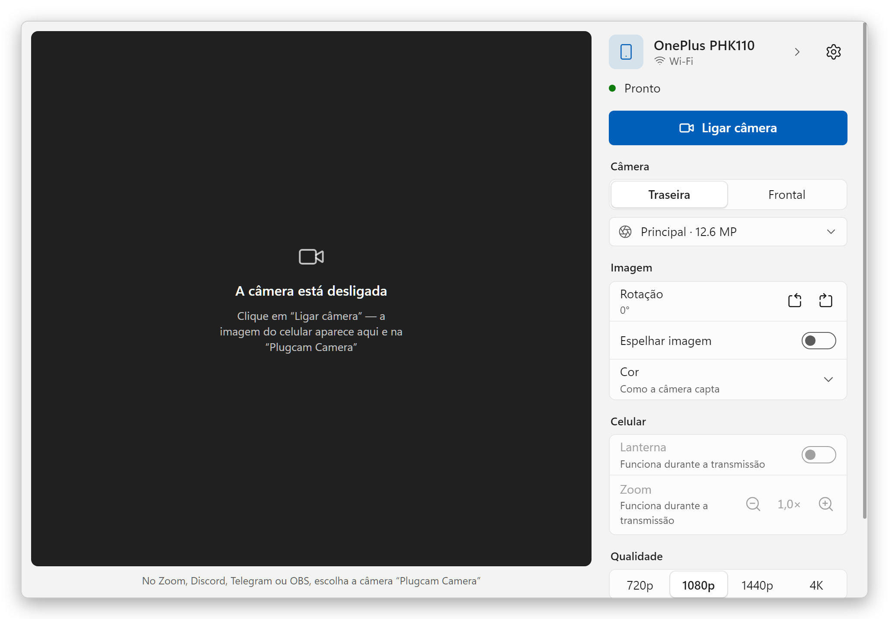
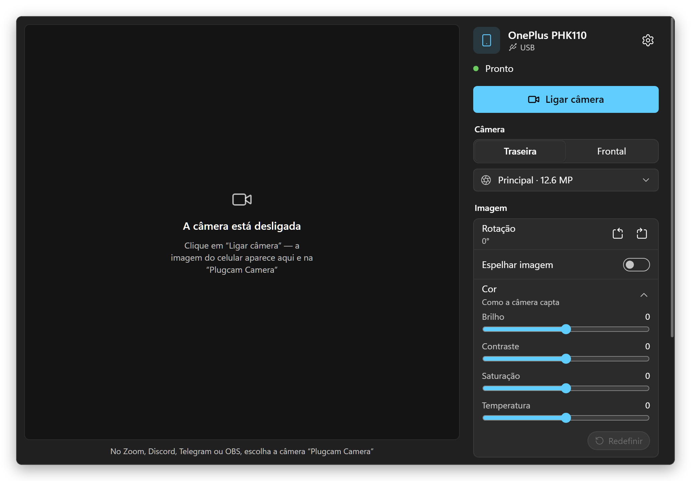
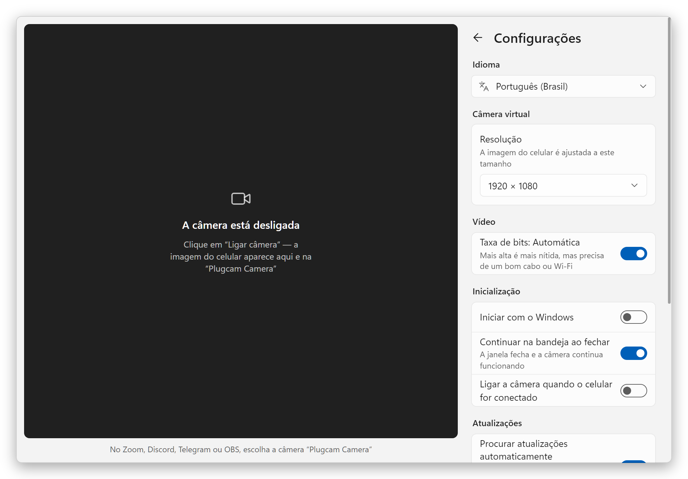
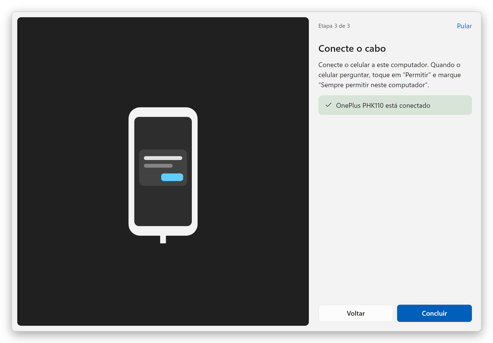
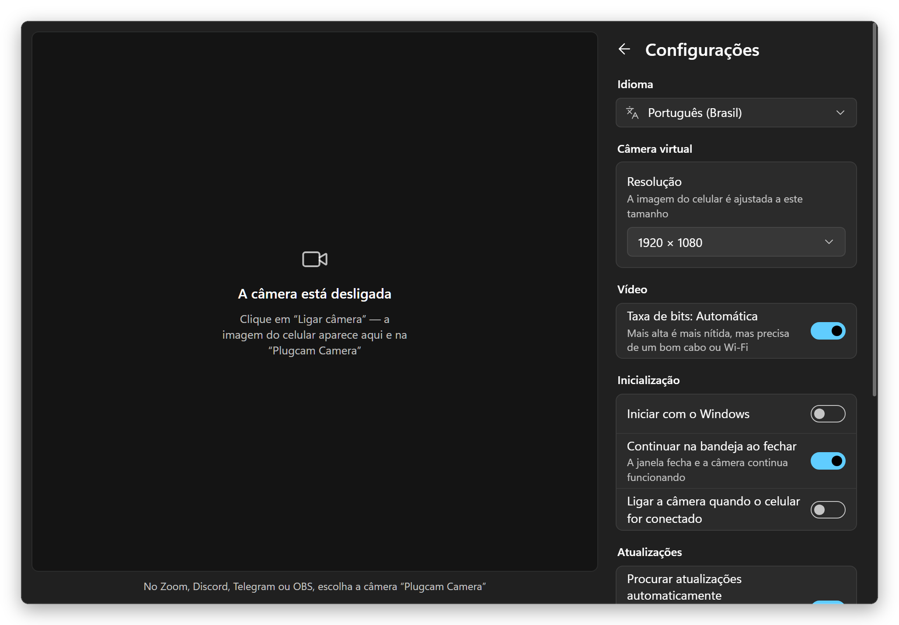

  

<h1 align="center">Plugcam</h1>

  <b>Seu celular Android como webcam no Windows.</b> 
  USB ou Wi-Fi, um botão. Sem app no celular, sem OBS, sem marca d’água. 
  Uma alternativa grátis e de código aberto ao DroidCam, Iriun e iVCam.

  <a href="../../README.md">English</a> ·
  <a href="README.ru.md">Русский</a> ·
  <a href="README.de.md">Deutsch</a> ·
  <a href="README.es.md">Español</a> ·
  <a href="README.fr.md">Français</a> ·
  <b>Português</b> ·
  <a href="README.zh-CN.md">简体中文</a> ·
  <a href="README.ja.md">日本語</a>

  

## Por que o Plugcam

- **Nada para instalar no celular.** O Plugcam conversa com o celular pela depuração USB e roda nele a parte de câmera do [scrcpy](https://github.com/Genymobile/scrcpy) enquanto você transmite.
- **USB ou Wi-Fi.** Pareie o celular uma vez por código QR ou por um código de seis dígitos, ou passe para o Wi-Fi, com um clique, um celular que está no cabo. Depois disso, ele se conecta sozinho sempre que estiver na rede e, se a rede cair por um instante, o Plugcam reconecta enquanto os apps continuam mostrando a última imagem.
- **Uma webcam de verdade no Windows.** A “Plugcam Camera” aparece junto das outras câmeras nos programas e navegadores que usam DirectShow: Zoom, Discord, Telegram Desktop, OBS, Chrome, Edge, Firefox e, portanto, também em chamadas pela web como o Google Meet.
- **Imagem boa.** Até 4K, se a câmera do celular captar, a 30 fps, ou 60 fps em celulares compatíveis. O celular codifica H.264 por hardware, o chip gráfico do PC decodifica, e o PC quase não sente.
- **Todos os controles que você espera.** Câmera traseira ou frontal e cada lente, zoom com 1×/2×/5×, lanterna, rotação para celular em pé, imagem espelhada, além de brilho, contraste, saturação e temperatura.
- **Grátis para sempre.** Sem marca d’água, sem limite de tempo, sem conta, sem telemetria. Apache-2.0.
- **Leve.** Um download de 7,2 MB. Na bandeja, ocupa 7 MB de memória; transmitindo de lá, menos de 1% da CPU. As atualizações se instalam sozinhas com um clique.
- **Fala a sua língua.** 13 idiomas, incluindo o português.

## Comparação

Os apps que as pessoas costumam testar primeiro, em setembro de 2026. Os planos gratuitos mudam com frequência, então cada nome leva à página do próprio fabricante.

| | Plugcam | [DroidCam](https://droidcam.app/) | [Iriun](https://iriun.com/) | [iVCam](https://www.e2esoft.com/ivcam/) | [Camo](https://camo.com/pricing) | [Phone Link](https://support.microsoft.com/en-us/windows/apps/phonelink/use-your-mobile-device-s-camera) |
|---|---|---|---|---|---|---|
| App no celular | **nenhum** | sim | sim | sim | sim | Link to Windows |
| Imagem grátis | **até 4K, 30 ou 60 fps** | 640×480; HD com marca d’água | até 4K, com marca d’água | marca d’água; 640×480 após o teste | até 720p | 720p |
| Anúncios | **não** | sim | sim | sim | não | não |
| Conexão | **USB, Wi-Fi** | USB, Wi-Fi | USB, Wi-Fi | USB, Wi-Fi | USB, Wi-Fi | Wi-Fi + Bluetooth |
| Código aberto | **sim, Apache-2.0** | só o cliente para PC | não | não | não | não |
| Download para Windows | **7,2 MB** | 98 MB | 8,8 MB, precisa do .NET Desktop Runtime | cerca de 43 MB | cerca de 475 MB | já vem no Windows 11 |

Duas opções sem app que você talvez já tenha: celulares com Android 14 ou mais novo podem funcionar sozinhos como webcam USB se o fabricante ativou esse modo (os Pixel ativam), e o [scrcpy](https://github.com/Genymobile/scrcpy), no qual o Plugcam se baseia, mostra a câmera numa janela (no Windows, é preciso o OBS para transformar essa janela em webcam). O que ainda falta ao Plugcam em relação aos apps pagos: som.

### Outros projetos de código aberto

Destes, só o Plugcam dá ao Windows uma webcam sem nada instalado no celular e sem o OBS no meio. Os outros têm coisas que o Plugcam não tem: suporte a versões mais antigas do Android ou (no caso do BestCam) uma câmera que os apps da Microsoft Store enxergam. Conferido no README de cada projeto em setembro de 2026. O scrcpy, base do Plugcam, é uma ferramenta de linha de comando; o Plugcam transforma o modo câmera dele em um app com prévia e controles.

| | Plugcam | [VCamdroid](https://github.com/darusc/VCamdroid) | [Android Webcam Project](https://github.com/soubhagyajit/Android-Webcam-Project) | [BestCam](https://github.com/OneLimeStudio/BestCam) (alfa) | [scrcpy](https://github.com/Genymobile/scrcpy) |
|---|---|---|---|---|---|
| App no celular | nenhum | sim | sim | sim | nenhum |
| Webcam no Windows | sim, DirectShow | sim, DirectShow | sim | sim, Media Foundation (Windows 11 22H2+) | pelo OBS ou outra ferramenta de captura de janela; webcam no Linux |
| Conexão | USB, Wi-Fi | USB, Wi-Fi | USB, Wi-Fi | USB | USB, Wi-Fi |
| Android | 12+ | 7.0+ | 8.0+ | 8.0+ | 12+ para a câmera |
| No PC | app com prévia, controles e guia inicial | app | app | script em Python; app anunciado | linha de comando; a janela mostra só o vídeo |
| Instalação | instalador ou zip portátil; atualiza sozinho | zip e depois install.bat como administrador | instalador | zip, sem instalador | zip ou winget |
| Licença | Apache-2.0 | MIT | GPL-3.0 | GPL-2.0 | Apache-2.0 |

### Leve para o seu PC

O Plugcam é um app nativo em Rust com uma pequena câmera virtual em C++. A janela é desenhada pelo WebView2 que já vem com o Windows (via [Tauri](https://tauri.app)), então não há um Chromium embutido como nos apps Electron. O vídeo em si nunca passa pela página web: a decodificação (com o decodificador H.264 do próprio Windows, no chip gráfico), a rotação, o redimensionamento, os ajustes de cor e a entrega dos quadros à câmera acontecem em Rust, e a janela só recebe uma pequena prévia enquanto está aberta. O WebView desenha sem o chip gráfico, o que economiza cerca de 80 MB numa janela tão simples. Fechado na bandeja, o Plugcam desliga o WebView por completo, então uma câmera rodando em segundo plano usa menos de 1% da CPU.

Medido num notebook com Ryzen 7 8845HS e Windows 11, contando o Plugcam e todos os seus processos do WebView2, com a média de um minuto feita pelo [`scripts/measure.ps1`](../../scripts/measure.ps1):

| | Memória | CPU |
|---|---|---|
| Na bandeja | **7 MB** | 0% |
| Janela aberta, câmera desligada | 83 MB | 0% |
| Transmitindo 1080p30, na bandeja | 99 MB | **0,6%** |
| Transmitindo 1080p30, janela aberta com prévia | 204 MB | 4,4% |

A memória é o que mostra a coluna “Memória” do “Gerenciador de Tarefas” (o conjunto de trabalho privado), então dá para comparar ali com qualquer outro app. A CPU é a fatia dos 16 threads do processador de 8 núcleos, também como no Gerenciador de Tarefas. A transmissão foi medida com um OnePlus 11R em 1080p a 30 fps. A imagem é decodificada na Radeon 780M integrada ao processador; a memória de vídeo dela é a RAM comum, então os buffers de quadros do decodificador entram na coluna de memória.

O adb, pelo qual o Plugcam conversa com o celular, soma cerca de 2 MB; ele é compartilhado com qualquer outra ferramenta Android que você usar.

## Como começar

1. **Instale.** Baixe `Plugcam_x.y.z_x64-setup.exe` na [versão mais recente](https://github.com/Qwinty/plugcam/releases/latest) e execute. O Windows pede permissão de administrador uma vez, para registrar a câmera. Depois disso, o Plugcam aparece no menu Iniciar. Prefere não instalar? Pegue `Plugcam_x.y.z_x64-portable.zip`, extraia onde quiser e execute `Plugcam.exe`; na primeira execução ele pede permissão de administrador uma vez, para adicionar a câmera.
2. **Ative a depuração USB** no celular: *Configurações → Sobre o telefone*, toque sete vezes em *Número da versão* e depois *Configurações → Sistema → Opções do desenvolvedor → Depuração USB*. O guia inicial do Plugcam mostra o caminho.
3. **Conecte o celular**, toque em *Permitir* nele e clique em **Ligar câmera**. No seu app de vídeo, escolha **Plugcam Camera**.
4. **Quer sem cabo?** Abra *Celulares e Wi-Fi* no painel lateral e pareie o celular por código QR ou código de pareamento (*Opções do desenvolvedor → Depuração por Wi-Fi*), ou clique em *Pelo cabo* enquanto ele ainda está conectado. O celular e o PC precisam estar na mesma rede.

O instalador ainda não é assinado, então o SmartScreen pode dizer “O Windows protegeu o computador”. Clique em *Mais informações → Executar assim mesmo*, ou confira o arquivo com o `.sha256` que acompanha a versão.

**As atualizações chegam sozinhas.** O Plugcam procura uma versão nova uma vez por dia; quando há uma, aparece o botão *Atualizar*. Um clique baixa a versão, confere a assinatura, instala e reinicia o Plugcam, que então mostra o que mudou. Tanto a versão instalada quanto a portátil se atualizam assim, e você pode desligar a verificação diária nas Configurações.

## Capturas de tela

<table>
  <tr>
    <td></td>
    <td></td>
  </tr>
  <tr>
    <td align="center">Tema escuro igual ao Windows</td>
    <td align="center">Configurações</td>
  </tr>
  <tr>
    <td></td>
    <td></td>
  </tr>
  <tr>
    <td align="center">Guia inicial</td>
    <td align="center">Configurações, tema escuro</td>
  </tr>
</table>

## Requisitos

- Windows 10 ou 11, 64 bits.
- Um celular com Android 12 ou mais novo (necessário para capturar a câmera) e um cabo USB que transfira dados ou a mesma rede Wi-Fi do PC.
- O driver USB costuma vir pelo Windows Update. Se o celular não for encontrado, instale o [driver USB do Google](https://developer.android.com/studio/run/win-usb) ou o do fabricante.

## Perguntas frequentes

### Dá para usar o celular Android como webcam no Windows sem instalar app no celular?

Sim, é isso que o Plugcam faz. Ele inicia a parte de câmera do scrcpy no celular pela depuração USB enquanto você transmite e a remove quando você para. Nenhum APK é instalado, e o celular não precisa de root, só de Android 12 ou mais novo. Celulares com Android 14 ou mais novo também podem ter um modo de webcam USB próprio, se o fabricante o ativou (os Pixel ativam).

### Existe alternativa grátis e de código aberto ao DroidCam, Iriun ou iVCam?

O Plugcam é uma. Ele é de código aberto, sob a Apache-2.0, e dá até 4K a 30 fps, ou 60 fps em celulares compatíveis, por USB ou Wi-Fi, sem marca d’água, anúncios, limite de tempo nem conta. O que esses apps têm e o Plugcam ainda não: som. Veja a [Comparação](#comparação).

### Quais apps conseguem usar a Plugcam Camera?

Programas e navegadores que usam câmeras DirectShow: Zoom, Discord, Telegram Desktop, OBS, Chrome, Edge e Firefox, então chamadas pelo navegador, como o Google Meet, também funcionam. Apps da Microsoft Store, como o app Câmera do Windows, não a enxergam; uma câmera Media Foundation para eles está planejada. O Microsoft Teams ainda não foi testado.

### Preciso do OBS?

Não. O Plugcam registra a própria câmera, então os programas de vídeo a enxergam diretamente. Com o scrcpy puro no Windows, você teria que capturar a janela dele no OBS e ligar a câmera virtual do OBS.

### O Plugcam funciona pelo Wi-Fi?

Sim, desde a versão 0.2.0. Abra *Celulares e Wi-Fi* e pareie o celular uma vez por código QR ou por um código de seis dígitos de *Opções do desenvolvedor → Depuração por Wi-Fi*, ou clique em *Pelo cabo* para passar para o Wi-Fi um celular que está no cabo. Celulares pareados se conectam sozinhos quando aparecem na rede. Pelo Wi-Fi, a imagem nunca fica mais que cerca de meio segundo atrasada: o Plugcam pula para a frente em vez de deixar o atraso se acumular e reduz a taxa de bits se a rede não der conta.

### O Plugcam transmite o som?

Não, o Plugcam envia só a imagem. Use o microfone do PC ou um headset.

### O Plugcam funciona com iPhone, no Mac ou no Linux?

Não, o Plugcam precisa de um celular Android e do Windows. No Linux, o próprio scrcpy consegue transformar o celular em webcam: carregue o módulo `v4l2loopback` e execute `scrcpy --video-source=camera --v4l2-sink=/dev/videoN --no-video-playback`. Num Mac com iPhone, a Câmera de Continuidade já vem no sistema.

### Quais celulares Android funcionam com o Plugcam?

O Plugcam precisa de Android 12 ou mais novo, porque o scrcpy só consegue capturar a câmera a partir do Android 12. Ele foi feito e testado com um OnePlus 11R (Android 15) e o Chrome; outros celulares devem funcionar do mesmo jeito. Alguns celulares listam lentes que não transmitem para apps de terceiros; o Plugcam percebe, oculta a lente e troca para a câmera principal. Se o seu celular ou app não funcionar, [abra uma issue](https://github.com/Qwinty/plugcam/issues) com o modelo do celular e o app. No Plugcam, **Configurações → Diagnóstico → Salvar relatório** cria um arquivo para anexar.

Como funciona, como compilar e licenças: veja o [README em inglês](../../README.md).

## Privacidade

O Plugcam não tem servidores e não envia nada para lugar nenhum. O vídeo vai do celular para o PC pelo cabo ou pela sua rede local e fica lá. A única coisa que ele busca na internet é a lista de versões no GitHub, uma vez por dia, para ver se há atualização (dá para desligar nas Configurações). As configurações ficam num arquivo JSON em `%APPDATA%\io.github.plugcam`, ou na pasta `data` da versão portátil.

Licença: [Apache-2.0](../../LICENSE). Componentes de terceiros: [THIRD_PARTY_NOTICES.md](../../THIRD_PARTY_NOTICES.md).
