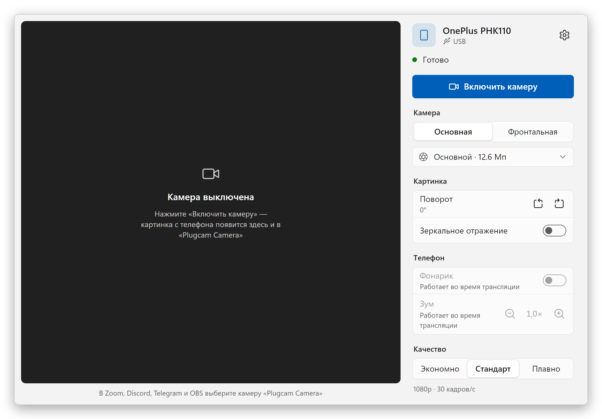

  

<h1 align="center">Plugcam</h1>

  <b>Android-телефон как веб-камера для Windows.</b> 
  Один кабель, одна кнопка. Без приложения на телефоне и без водяных знаков, бесплатно и с открытым кодом.

  <a href="../../README.md">English</a> ·
  <b>Русский</b> ·
  <a href="README.de.md">Deutsch</a> ·
  <a href="README.es.md">Español</a> ·
  <a href="README.fr.md">Français</a> ·
  <a href="README.pt-BR.md">Português</a> ·
  <a href="README.zh-CN.md">简体中文</a> ·
  <a href="README.ja.md">日本語</a>

  

## Почему Plugcam

- **На телефон ничего ставить не нужно.** Plugcam работает через отладку по USB и на время трансляции запускает на телефоне серверную часть [scrcpy](https://github.com/Genymobile/scrcpy).
- **Настоящая веб-камера для Windows.** «Plugcam Camera» появляется рядом с другими камерами в программах и браузерах, которые используют DirectShow: Zoom, Discord, Telegram Desktop, OBS, Chrome, Edge, Firefox, а значит, и в звонках вроде Google Meet.
- **Хорошая картинка.** До 1080p при 30 кадрах/с, на подходящих телефонах — 60 кадров/с. Видео сжимает аппаратный кодек телефона, так что компьютер почти не нагружается.
- **Всё нужное под рукой.** Основная и фронтальная камеры и выбор объектива, зум с кнопками 1×/2×/5×, фонарик, поворот для телефона, стоящего вертикально, зеркальное отражение.
- **Бесплатно навсегда.** Без водяных знаков, ограничений по времени, учётной записи и телеметрии. Лицензия Apache-2.0.
- **Говорит на вашем языке.** 13 языков, в том числе русский и украинский.

## Как начать

1. **Установите.** Скачайте `Plugcam_x.y.z_x64-setup.exe` со [страницы последнего выпуска](https://github.com/Qwinty/plugcam/releases/latest) и запустите. Windows один раз попросит права администратора, чтобы зарегистрировать камеру.
2. **Включите отладку по USB** на телефоне: *Настройки → О телефоне*, семь раз нажмите *Номер сборки*, затем *Настройки → Система → Для разработчиков → Отладка по USB*. Мастер первого запуска подскажет по шагам.
3. **Подключите телефон**, нажмите на нём *Разрешить* и нажмите **Включить камеру**. В программе видеосвязи выберите **Plugcam Camera**.

Установщик пока не подписан, поэтому SmartScreen может показать «Система Windows защитила ваш компьютер». Нажмите *Подробнее → Выполнить в любом случае* или сверьте файл с `.sha256` рядом с ним в выпуске.

## Скриншоты

<table>
  <tr>
    <td></td>
    <td></td>
  </tr>
  <tr>
    <td align="center">Тёмная тема как в Windows · Русский</td>
    <td align="center">Настройки · Deutsch</td>
  </tr>
  <tr>
    <td></td>
    <td></td>
  </tr>
  <tr>
    <td align="center">Мастер первого запуска · 日本語</td>
    <td align="center">Всё готово · Español</td>
  </tr>
  <tr>
    <td></td>
    <td></td>
  </tr>
  <tr>
    <td align="center">Настройки, тёмная тема · 简体中文</td>
    <td align="center">Мастер первого запуска · Français</td>
  </tr>
</table>

## Что нужно

- Windows 10 или 11, 64-бит.
- Телефон с Android 12 или новее (без этого захват камеры не работает) и кабель USB, который передаёт данные.
- Драйвер USB для телефона обычно приходит через Центр обновления Windows. Если телефон не находится, установите [USB-драйвер Google](https://developer.android.com/studio/run/win-usb) или драйвер производителя.

## Что стоит знать

- **Приложения из Microsoft Store**, например «Камера» Windows, не видят Plugcam Camera: это камера DirectShow, с ней работают обычные программы и браузеры. Камера Media Foundation для приложений из Store запланирована.
- **Wi-Fi** пока нет, это следующий шаг.
- **Некоторые объективы не дают картинку.** Телефоны показывают в списке объективы, которые не отдают видео сторонним программам. Plugcam это замечает, скрывает такой объектив и включает основную камеру.
- **Звука нет.** Используйте микрофон компьютера или гарнитуру.
- Plugcam сделан и проверен на OnePlus 11R (Android 15) и в Chrome. Другие телефоны и программы должны работать так же; если нет, [напишите об этом](https://github.com/Qwinty/plugcam/issues), указав модель телефона и программу.

Как это устроено, сборка из исходников и лицензии — в [README на английском](../../README.md). Подробное ТЗ на русском — в [docs/SPEC.md](../SPEC.md).

## Конфиденциальность

У Plugcam нет серверов, программа ничего никуда не отправляет. Видео идёт с телефона на компьютер по кабелю и там остаётся.

Лицензия: [Apache-2.0](../../LICENSE). Сторонние компоненты перечислены в [THIRD_PARTY_NOTICES.md](../../THIRD_PARTY_NOTICES.md).
