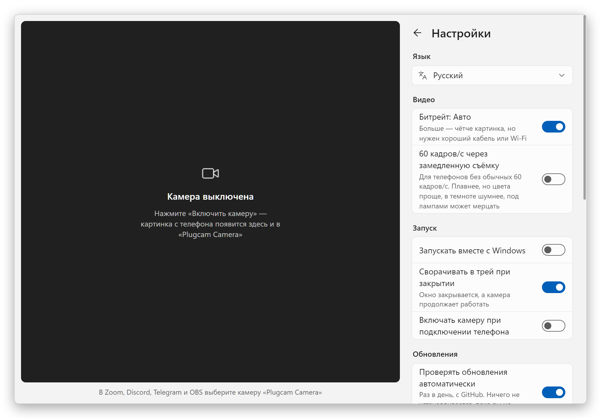
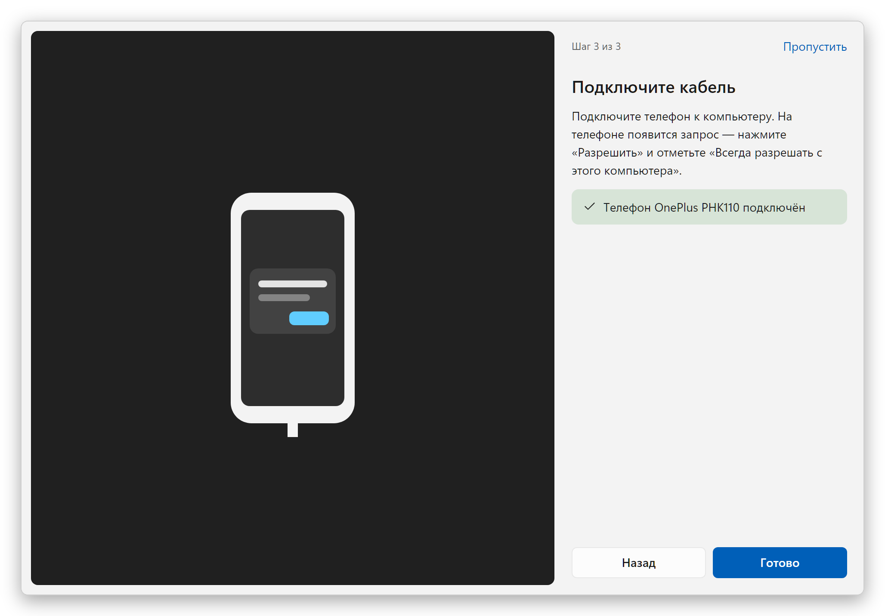
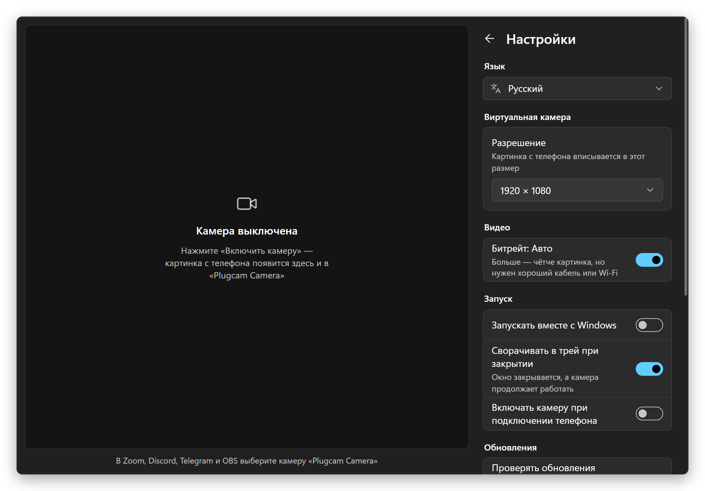

  

<h1 align="center">Plugcam</h1>

  <b>Android-телефон как веб-камера для Windows.</b> 
  Один кабель, одна кнопка. Без приложения на телефоне, без OBS и без водяных знаков. 
  Бесплатная альтернатива DroidCam, Iriun и iVCam с открытым кодом.

  <a href="../../README.md">English</a> ·
  <b>Русский</b> ·
  <a href="README.de.md">Deutsch</a> ·
  <a href="README.es.md">Español</a> ·
  <a href="README.fr.md">Français</a> ·
  <a href="README.pt-BR.md">Português</a> ·
  <a href="README.zh-CN.md">简体中文</a> ·
  <a href="README.ja.md">日本語</a>

  

## Почему Plugcam

- **На телефон ничего ставить не нужно.** Plugcam работает через отладку по USB и на время трансляции запускает на телефоне серверную часть [scrcpy](https://github.com/Genymobile/scrcpy).
- **Настоящая веб-камера для Windows.** «Plugcam Camera» появляется рядом с другими камерами в программах и браузерах, которые используют DirectShow: Zoom, Discord, Telegram Desktop, OBS, Chrome, Edge, Firefox, а значит, и в звонках вроде Google Meet.
- **Хорошая картинка.** До 1080p при 30 кадрах/с, на подходящих телефонах — 60 кадров/с. Видео сжимает в H.264 аппаратный кодек телефона, а распаковывает графический чип компьютера, так что компьютер почти не нагружается.
- **Всё нужное под рукой.** Основная и фронтальная камеры и выбор объектива, зум с кнопками 1×/2×/5×, фонарик, поворот для телефона, стоящего вертикально, зеркальное отражение, а также яркость, контраст, насыщенность и теплота.
- **Бесплатно навсегда.** Без водяных знаков, ограничений по времени, учётной записи и телеметрии. Лицензия Apache-2.0.
- **Лёгкий.** Загрузка весит 7,4 МБ. В трее программа занимает 7 МБ памяти, а трансляция из трея — меньше 1% процессора. Обновления ставятся сами, в один клик.
- **Говорит на вашем языке.** 13 языков, в том числе русский и украинский.

## Сравнение с другими

Приложения, которые обычно пробуют первыми, по состоянию на сентябрь 2026 года. Бесплатные тарифы часто меняются, поэтому каждое название ведёт на страницу самого разработчика.

| | Plugcam | [DroidCam](https://droidcam.app/) | [Iriun](https://iriun.com/) | [iVCam](https://www.e2esoft.com/ivcam/) | [Camo](https://camo.com/pricing) | [Phone Link](https://support.microsoft.com/en-us/windows/apps/phonelink/use-your-mobile-device-s-camera) |
|---|---|---|---|---|---|---|
| Приложение на телефоне | **не нужно** | да | да | да | да | Link to Windows |
| Бесплатная картинка | **1080p, 30 или 60 кадров/с** | 640×480; в HD водяной знак | до 4K, с водяным знаком | водяной знак; 640×480 после пробного периода | до 720p | 720p |
| Реклама | **нет** | есть | есть | есть | нет | нет |
| Подключение | USB | USB, Wi-Fi | USB, Wi-Fi | USB, Wi-Fi | USB, Wi-Fi | Wi-Fi + Bluetooth |
| Открытый код | **да, Apache-2.0** | только клиент для ПК | нет | нет | нет | нет |
| Загрузка для Windows | **7,4 МБ** | 98 МБ | 8,8 МБ, нужен .NET Desktop Runtime | около 43 МБ | около 475 МБ | встроено в Windows 11 |

Два варианта без приложения, которые у вас, возможно, уже есть: телефоны с Android 14 или новее сами работают как USB-веб-камера, если производитель включил этот режим (на Pixel он включён), а [scrcpy](https://github.com/Genymobile/scrcpy), на котором построен Plugcam, показывает камеру в окне (чтобы в Windows превратить это окно в веб-камеру, нужен OBS). Чего Plugcam пока не хватает по сравнению с платными приложениями: Wi-Fi, 4K и звука.

### Другие проекты с открытым кодом

Из них только Plugcam делает веб-камеру для Windows, когда на телефоне ничего не установлено, а OBS в цепочке не нужен. Зато у остальных есть то, чего нет у Plugcam: Wi-Fi, 4K, поддержка более старых версий Android или (у BestCam) камера, которую видят приложения из Microsoft Store. Сверено с README каждого проекта в сентябре 2026 года. scrcpy, на котором построен Plugcam, работает из командной строки, а Plugcam превращает его режим камеры в приложение с превью и настройками.

| | Plugcam | [VCamdroid](https://github.com/darusc/VCamdroid) | [Android Webcam Project](https://github.com/soubhagyajit/Android-Webcam-Project) | [BestCam](https://github.com/OneLimeStudio/BestCam) (альфа) | [scrcpy](https://github.com/Genymobile/scrcpy) |
|---|---|---|---|---|---|
| Приложение на телефоне | не нужно | да | да | да | не нужно |
| Веб-камера в Windows | да, DirectShow | да, DirectShow | да | да, Media Foundation (Windows 11 22H2+) | через OBS или другую программу захвата окна; в Linux работает как веб-камера |
| Подключение | USB | USB, Wi-Fi | USB, Wi-Fi | USB | USB, Wi-Fi |
| Android | 12+ | 7.0+ | 8.0+ | 8.0+ | 12+ для камеры |
| На компьютере | приложение с превью, настройками и мастером первого запуска | приложение | приложение | скрипт на Python, приложение обещают | командная строка, в окне только видео |
| Установка | установщик или портативный архив, обновляется сам | архив и install.bat от имени администратора | установщик | архив без установщика | архив или winget |
| Лицензия | Apache-2.0 | MIT | GPL-3.0 | GPL-2.0 | Apache-2.0 |

### Лёгкий для компьютера

Plugcam — нативное приложение на Rust с небольшой виртуальной камерой на C++. Окно рисует WebView2, который входит в Windows (через [Tauri](https://tauri.app)), поэтому в комплекте нет своего Chromium, как в приложениях на Electron. Само видео через веб-страницу не проходит: декодирование (встроенным декодером H.264 из Windows, на графическом чипе), поворот, масштабирование, настройка цвета и передача кадров в камеру выполняются в Rust, а окно, пока оно открыто, получает только маленькое превью. WebView рисует без графического чипа, и для такого простого окна это экономит около 80 МБ. Когда Plugcam свёрнут в трей, он полностью выключает WebView, так что камера, работающая в фоне, занимает меньше 1% процессора.

Замеры на ноутбуке с Ryzen 7 8845HS и Windows 11, с учётом Plugcam и всех его процессов WebView2, среднее за минуту по скрипту [`scripts/measure.ps1`](../../scripts/measure.ps1):

| | Память | ЦП |
|---|---|---|
| В трее | **7 МБ** | 0% |
| Окно открыто, камера выключена | 83 МБ | 0% |
| Трансляция 1080p30, в трее | 99 МБ | **0,6%** |
| Трансляция 1080p30, окно открыто с превью | 204 МБ | 4,4% |

Память — это то, что показывает столбец «Память» в «Диспетчере задач» (частный рабочий набор), так что её можно сравнить там с любым другим приложением. ЦП — доля от всех 16 потоков 8-ядерного процессора, тоже как в «Диспетчере задач». Трансляция замерена с OnePlus 11R в 1080p и 30 кадрах/с. Картинку декодирует Radeon 780M, встроенный в процессор; его видеопамять — это обычная оперативная память, поэтому буферы кадров декодера учтены в столбце памяти.

adb, через который Plugcam общается с телефоном, добавляет около 2 МБ; он общий для всех инструментов Android, которые вы запускаете.

## Как начать

1. **Установите.** Скачайте `Plugcam_x.y.z_x64-setup.exe` со [страницы последнего выпуска](https://github.com/Qwinty/plugcam/releases/latest) и запустите. Windows один раз попросит права администратора, чтобы зарегистрировать камеру. После этого Plugcam появится в меню «Пуск». Не хотите устанавливать? Возьмите `Plugcam_x.y.z_x64-portable.zip`, распакуйте в любое место и запустите `Plugcam.exe`; при первом запуске он один раз попросит права администратора, чтобы добавить камеру.
2. **Включите отладку по USB** на телефоне: *Настройки → О телефоне*, семь раз нажмите *Номер сборки*, затем *Настройки → Система → Для разработчиков → Отладка по USB*. Мастер первого запуска подскажет по шагам.
3. **Подключите телефон**, нажмите на нём *Разрешить* и нажмите **Включить камеру**. В программе видеосвязи выберите **Plugcam Camera**.

Установщик пока не подписан, поэтому SmartScreen может показать «Система Windows защитила ваш компьютер». Нажмите *Подробнее → Выполнить в любом случае* или сверьте файл с `.sha256` рядом с ним в выпуске.

**Обновления приходят сами.** Раз в день Plugcam проверяет, нет ли новой версии; если есть, появляется кнопка *Обновить*. Один клик — и Plugcam скачает её, проверит подпись, установит и перезапустится, а затем покажет, что изменилось. Так обновляются и установленная, и портативная версии; ежедневную проверку можно отключить в настройках.

## Скриншоты

<table>
  <tr>
    <td></td>
    <td></td>
  </tr>
  <tr>
    <td align="center">Тёмная тема как в Windows</td>
    <td align="center">Настройки</td>
  </tr>
  <tr>
    <td></td>
    <td></td>
  </tr>
  <tr>
    <td align="center">Мастер первого запуска</td>
    <td align="center">Настройки, тёмная тема</td>
  </tr>
</table>

## Что нужно

- Windows 10 или 11, 64-бит.
- Телефон с Android 12 или новее (без этого захват камеры не работает) и кабель USB, который передаёт данные.
- Драйвер USB для телефона обычно приходит через Центр обновления Windows. Если телефон не находится, установите [USB-драйвер Google](https://developer.android.com/studio/run/win-usb) или драйвер производителя.

## Частые вопросы

### Можно ли использовать Android-телефон как веб-камеру для компьютера на Windows без приложения на телефоне?

Да, именно это Plugcam и делает. На время трансляции он запускает на телефоне камерную часть scrcpy через отладку по USB, а после остановки удаляет её. APK на телефон не устанавливается, root не нужен, нужен только Android 12 или новее. На телефонах с Android 14 или новее может быть и встроенный режим USB-веб-камеры, если производитель его включил (на Pixel он включён).

### Есть ли бесплатный аналог DroidCam, Iriun или iVCam с открытым кодом?

Да, Plugcam. Его код открыт под лицензией Apache-2.0, он даёт 1080p при 30 кадрах/с, а на подходящих телефонах 60 кадров/с, без водяного знака, рекламы, ограничений по времени и учётной записи. Чего у Plugcam пока нет по сравнению с этими приложениями: Wi-Fi, 4K и звука. Подробнее в разделе [«Сравнение с другими»](#сравнение-с-другими).

### В каких программах работает Plugcam Camera?

В программах и браузерах, которые используют камеры DirectShow: Zoom, Discord, Telegram Desktop, OBS, Chrome, Edge и Firefox, так что звонки в браузере вроде Google Meet тоже работают. Приложения из Microsoft Store, например «Камера» Windows, её не видят; камера Media Foundation для них запланирована. Microsoft Teams пока не проверяли.

### Нужен ли OBS для Plugcam?

Нет. Plugcam регистрирует собственную камеру, и программы видеосвязи на компьютере видят её напрямую. С обычным scrcpy в Windows пришлось бы захватывать его окно в OBS и включать виртуальную камеру OBS.

### Работает ли Plugcam по Wi-Fi?

Пока нет, только по кабелю USB. Wi-Fi следующий на очереди.

### Передаёт ли Plugcam звук?

Нет, Plugcam передаёт только картинку. Используйте микрофон компьютера или гарнитуру.

### Работает ли Plugcam с iPhone, на macOS или Linux?

Нет, Plugcam нужны телефон на Android и Windows. В Linux сделать из телефона веб-камеру умеет сам scrcpy: загрузите модуль `v4l2loopback` и выполните `scrcpy --video-source=camera --v4l2-sink=/dev/videoN --no-video-playback`. На Mac с iPhone есть встроенная «Камера Continuity».

### Какие Android-телефоны подходят для Plugcam?

Plugcam нужен Android 12 или новее, потому что scrcpy умеет захватывать камеру только начиная с Android 12. Plugcam сделан и проверен на OnePlus 11R (Android 15) и в Chrome; другие телефоны должны работать так же. Некоторые телефоны показывают в списке объективы, которые не отдают видео сторонним программам; Plugcam это замечает, скрывает такой объектив и включает основную камеру. Если ваш телефон или программа не работают, [напишите об этом](https://github.com/Qwinty/plugcam/issues), указав модель телефона и программу.

Как это устроено, сборка из исходников и лицензии — в [README на английском](../../README.md). Подробное ТЗ на русском — в [docs/SPEC.md](../SPEC.md).

## Конфиденциальность

У Plugcam нет серверов, программа ничего никуда не отправляет. Видео идёт с телефона на компьютер по кабелю и там остаётся. Единственное, что программа загружает из интернета, — список выпусков на GitHub, раз в день, чтобы узнать, есть ли обновление (это можно отключить в настройках). Настройки хранятся в JSON-файле в `%APPDATA%\io.github.plugcam`, а в портативной версии — в папке `data`.

Лицензия: [Apache-2.0](../../LICENSE). Сторонние компоненты перечислены в [THIRD_PARTY_NOTICES.md](../../THIRD_PARTY_NOTICES.md).
