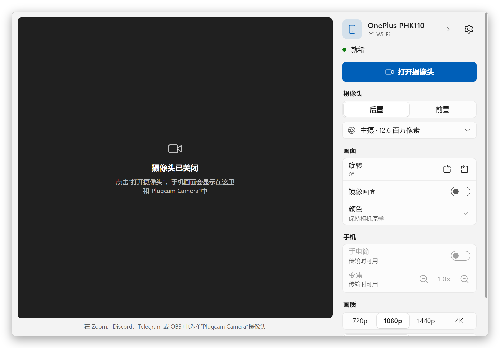
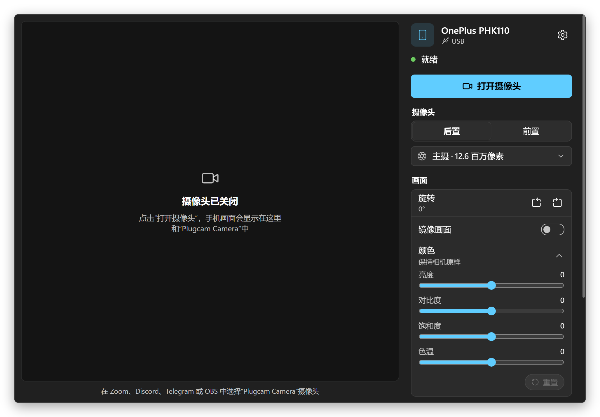
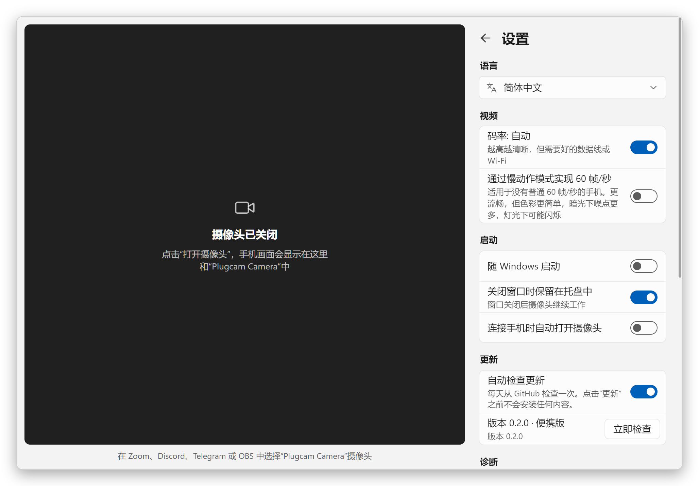
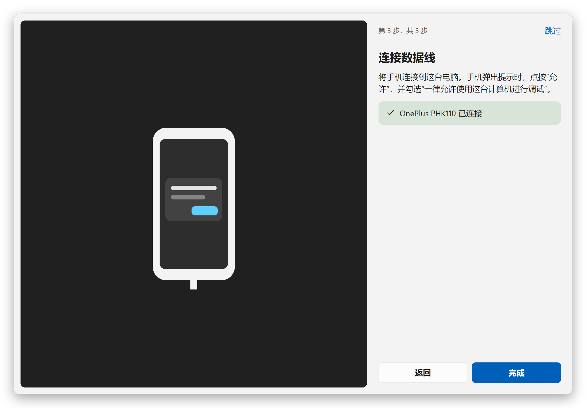

  

<h1 align="center">Plugcam</h1>

  <b>把安卓手机变成 Windows 摄像头。</b> 
  一根数据线，一个按钮。手机上无需安装应用，不用 OBS，没有水印。 
  免费开源的 DroidCam、Iriun 和 iVCam 替代品。

  <a href="../../README.md">English</a> ·
  <a href="README.ru.md">Русский</a> ·
  <a href="README.de.md">Deutsch</a> ·
  <a href="README.es.md">Español</a> ·
  <a href="README.fr.md">Français</a> ·
  <a href="README.pt-BR.md">Português</a> ·
  <b>简体中文</b> ·
  <a href="README.ja.md">日本語</a>

  

## 为什么选择 Plugcam

- **手机上什么都不用装。** Plugcam 通过 USB 调试与手机通信，只在传输期间在手机上运行 [scrcpy](https://github.com/Genymobile/scrcpy) 的摄像头部分。
- **真正的 Windows 摄像头。** “Plugcam Camera”会和其他摄像头一起出现在使用 DirectShow 的软件和浏览器中：Zoom、Discord、Telegram Desktop、OBS、Chrome、Edge、Firefox，因此也能用于 Google Meet 等网页通话。
- **画质好。** 最高 4K（取决于手机摄像头能拍到的分辨率），30 帧/秒，支持的手机可达 60 帧/秒。手机用硬件编码 H.264，电脑的显卡芯片负责解码，电脑几乎没有负担。
- **该有的控制都有。** 后置或前置摄像头及各个镜头、1×/2×/5× 变焦、手电筒、竖放手机时的画面旋转、镜像，以及亮度、对比度、饱和度和色温。
- **永久免费。** 没有水印、没有时长限制、无需账号、没有遥测。Apache-2.0 许可。
- **轻巧。** 下载仅 7.4 MB。在托盘中待命时只占 7 MB 内存；从托盘传输画面时，CPU 占用不到 1%。更新一键即可自动安装。
- **支持你的语言。** 13 种语言，包括简体中文。

## 与同类软件对比

以下是大家通常最先尝试的几款应用，信息截至 2026 年 9 月。免费版的限制经常变化，所以每个名称都链接到厂商自己的页面。

| | Plugcam | [DroidCam](https://droidcam.app/) | [Iriun](https://iriun.com/) | [iVCam](https://www.e2esoft.com/ivcam/) | [Camo](https://camo.com/pricing) | [Phone Link](https://support.microsoft.com/en-us/windows/apps/phonelink/use-your-mobile-device-s-camera) |
|---|---|---|---|---|---|---|
| 手机端应用 | **不需要** | 需要 | 需要 | 需要 | 需要 | Link to Windows |
| 免费版画质 | **最高 4K，30 或 60 帧/秒** | 640×480；HD 有水印 | 最高 4K，有水印 | 有水印；试用期后 640×480 | 最高 720p | 720p |
| 广告 | **无** | 有 | 有 | 有 | 无 | 无 |
| 连接方式 | USB | USB、Wi-Fi | USB、Wi-Fi | USB、Wi-Fi | USB、Wi-Fi | Wi-Fi + 蓝牙 |
| 开源 | **是，Apache-2.0** | 仅电脑客户端 | 否 | 否 | 否 | 否 |
| Windows 下载大小 | **7.4 MB** | 98 MB | 8.8 MB，需要 .NET Desktop Runtime | 约 43 MB | 约 475 MB | Windows 11 内置 |

你可能已经有两种无需安装应用的办法：Android 14 及更高版本的手机，如果厂商开启了这一模式（Pixel 已开启），本身就能当作 USB 摄像头；Plugcam 所基于的 [scrcpy](https://github.com/Genymobile/scrcpy) 也能在窗口中显示摄像头画面（在 Windows 上需要借助 OBS 才能把这个窗口变成摄像头）。与付费应用相比，Plugcam 目前还缺少 Wi-Fi 和声音。

### 其他开源项目

在这些项目中，只有 Plugcam 能在手机上什么都不装、中间也不经过 OBS 的情况下为 Windows 提供摄像头。其他项目也有 Plugcam 没有的功能：Wi-Fi、支持更旧的 Android 版本，或者（BestCam）Microsoft Store 应用也能看到的摄像头。信息于 2026 年 9 月依据各项目的 README 核对。Plugcam 所基于的 scrcpy 是命令行工具，Plugcam 把它的摄像头模式做成了带预览和控制项的应用。

| | Plugcam | [VCamdroid](https://github.com/darusc/VCamdroid) | [Android Webcam Project](https://github.com/soubhagyajit/Android-Webcam-Project) | [BestCam](https://github.com/OneLimeStudio/BestCam)（alpha） | [scrcpy](https://github.com/Genymobile/scrcpy) |
|---|---|---|---|---|---|
| 手机端应用 | 不需要 | 需要 | 需要 | 需要 | 不需要 |
| Windows 摄像头 | 是，DirectShow | 是，DirectShow | 是 | 是，Media Foundation（Windows 11 22H2+） | 需借助 OBS 或其他窗口捕获工具；在 Linux 上可作为摄像头 |
| 连接方式 | USB | USB、Wi-Fi | USB、Wi-Fi | USB | USB、Wi-Fi |
| Android | 12+ | 7.0+ | 8.0+ | 8.0+ | 摄像头需要 12+ |
| 电脑端 | 带预览、控制项和初始设置向导的应用 | 应用 | 应用 | Python 脚本（应用尚未发布） | 命令行，窗口里只有画面 |
| 安装 | 安装程序或便携版 zip，自动更新 | zip，再以管理员身份运行 install.bat | 安装程序 | zip，没有安装程序 | zip 或 winget |
| 许可证 | Apache-2.0 | MIT | GPL-3.0 | GPL-2.0 | Apache-2.0 |

### 对电脑的负担很小

Plugcam 是一款原生 Rust 应用，配有一个小巧的 C++ 虚拟摄像头。窗口由 Windows 自带的 WebView2 绘制（通过 [Tauri](https://tauri.app)），因此不像 Electron 应用那样捆绑 Chromium。视频本身从不经过网页：解码（使用 Windows 自带的 H.264 解码器，在显卡芯片上完成）、旋转、缩放、色彩调整以及把画面交给摄像头，全部在 Rust 中完成，窗口打开时只接收一个小预览。WebView 绘制时不使用显卡芯片，对这样简单的窗口可节省约 80 MB。关闭到托盘后，Plugcam 会彻底关闭 WebView，因此在后台运行的摄像头 CPU 占用不到 1%。

测试环境为搭载 Ryzen 7 8845HS 的 Windows 11 笔记本，统计 Plugcam 及其所有 WebView2 进程，用 [`scripts/measure.ps1`](../../scripts/measure.ps1) 取一分钟的平均值：

| | 内存 | CPU |
|---|---|---|
| 在托盘中 | **7 MB** | 0% |
| 窗口打开，摄像头关闭 | 83 MB | 0% |
| 传输 1080p30 画面，在托盘中 | 99 MB | **0.6%** |
| 传输 1080p30 画面，窗口打开并显示预览 | 204 MB | 4.4% |

内存即“任务管理器”中“内存”列显示的值（专用工作集），因此可以在那里与其他任何应用比较。CPU 为占 8 核处理器全部 16 个线程的比例，同样与任务管理器一致。传输画面在 OnePlus 11R 上以 1080p、30 fps 测得。画面由处理器内置的 Radeon 780M 解码；它的显存就是普通内存，所以解码器的帧缓冲计入内存一栏。

Plugcam 通过 adb 与手机通信，adb 另占约 2 MB，并与你运行的其他 Android 工具共用。

## 快速开始

1. **安装。** 从[最新版本](https://github.com/Qwinty/plugcam/releases/latest)下载 `Plugcam_x.y.z_x64-setup.exe` 并运行。Windows 会请求一次管理员权限，用于注册摄像头。安装后 Plugcam 会出现在开始菜单中。不想安装？可以下载 `Plugcam_x.y.z_x64-portable.zip`，解压到任意位置并运行 `Plugcam.exe`；首次启动时它会请求一次管理员权限，用于添加摄像头。
2. **在手机上开启 USB 调试**：*设置 → 关于手机*，连续点按 *版本号* 七次，然后 *设置 → 系统 → 开发者选项 → USB 调试*。Plugcam 的初始设置向导会一步步引导你。
3. **连接手机**，在手机上点按 *允许*，然后点击 **打开摄像头**。在视频软件中选择 **Plugcam Camera**。

安装程序暂未签名，SmartScreen 可能会提示“Windows 已保护你的电脑”。点击 *更多信息 → 仍要运行*，或用发布页中附带的 `.sha256` 校验文件。

**更新自动送达。** Plugcam 每天检查一次新版本；有新版本时会出现 *更新* 按钮。点一下即可下载、校验签名、安装并重启 Plugcam，随后显示更新内容。安装版和便携版都以这种方式更新，你也可以在设置中关闭每日检查。

## 截图

<table>
  <tr>
    <td></td>
    <td></td>
  </tr>
  <tr>
    <td align="center">深色主题跟随 Windows</td>
    <td align="center">设置</td>
  </tr>
  <tr>
    <td></td>
    <td></td>
  </tr>
  <tr>
    <td align="center">初始设置向导</td>
    <td align="center">设置，深色主题</td>
  </tr>
</table>

## 系统要求

- Windows 10 或 11，64 位。
- Android 12 或更高版本的手机（摄像头采集需要），以及能传输数据的 USB 数据线。
- 手机的 USB 驱动通常会通过 Windows 更新自动安装。如果找不到手机，请安装 [Google USB 驱动](https://developer.android.com/studio/run/win-usb) 或手机厂商的驱动。

## 常见问题

### 手机不装软件，安卓手机能当 Windows 电脑摄像头用吗？

可以，这正是 Plugcam 的用途。传输画面时，它通过 USB 调试在手机上启动 scrcpy 的摄像头部分，停止后再将其移除。手机上不会安装任何 APK，也不需要 root，只要 Android 12 或更高版本即可。Android 14 及更高版本的手机，如果厂商开启了这一模式（Pixel 已开启），可能还自带 USB 摄像头模式。

### 有没有免费开源的 DroidCam、Iriun 或 iVCam 替代品？

Plugcam 就是一个。它以 Apache-2.0 许可开源，提供最高 4K、30 帧/秒的画面，支持的手机可达 60 帧/秒，没有水印、没有广告、没有时长限制，也无需账号。这些应用有而 Plugcam 暂时还没有的：Wi-Fi 和声音。参见[与同类软件对比](#与同类软件对比)。

### 哪些软件能用 Plugcam Camera？

使用 DirectShow 摄像头的桌面软件和浏览器：Zoom、Discord、Telegram Desktop、OBS、Chrome、Edge 和 Firefox，因此 Google Meet 等网页通话也能用。Microsoft Store 应用（例如 Windows 相机应用）看不到它；面向这些应用的 Media Foundation 摄像头已在计划中。Microsoft Teams 尚未测试。

### 需要装 OBS 吗？

不需要。Plugcam 会注册自己的摄像头，桌面视频软件可以直接看到它。如果在 Windows 上只用 scrcpy，就得在 OBS 中捕获它的窗口，再开启 OBS 的虚拟摄像头。

### Plugcam 能用 Wi-Fi 无线连接吗？

暂时不能，目前只支持 USB 数据线。Wi-Fi 是下一步计划。

### Plugcam 有声音吗？

没有，Plugcam 只传输画面。请使用电脑的麦克风或耳机。

### Plugcam 支持 iPhone 吗？能在 macOS 或 Linux 上用吗？

不支持，Plugcam 需要安卓手机和 Windows。在 Linux 上，scrcpy 本身就能把手机变成摄像头：加载 `v4l2loopback` 模块，然后运行 `scrcpy --video-source=camera --v4l2-sink=/dev/videoN --no-video-playback`。在 Mac 上搭配 iPhone，可以直接使用系统内置的连续互通相机。

### Plugcam 支持哪些安卓手机？

Plugcam 需要 Android 12 或更高版本，因为 scrcpy 从 Android 12 起才能采集摄像头。它基于 OnePlus 11R（Android 15）和 Chrome 开发并测试，其他手机应该也能正常工作。有些手机会列出一些不向第三方应用输出画面的镜头；Plugcam 会发现这种情况，隐藏该镜头并切换到主摄。如果你的手机或软件无法正常工作，请[提交 issue](https://github.com/Qwinty/plugcam/issues)，并注明手机型号和软件。在 Plugcam 中，**设置 → 诊断 → 保存报告** 会生成一个可附加的文件。

工作原理、从源码构建和许可证信息，请参阅[英文 README](../../README.md)。

## 隐私

Plugcam 没有服务器，不会向任何地方发送数据。视频通过数据线从手机传到电脑，只留在你的电脑上。它唯一会从网上获取的是 GitHub 上的版本列表，每天一次，用于检查是否有更新（可在设置中关闭）。设置保存在 `%APPDATA%\io.github.plugcam` 中的 JSON 文件里，便携版则保存在 `data` 文件夹中。

许可证：[Apache-2.0](../../LICENSE)。第三方组件见 [THIRD_PARTY_NOTICES.md](../../THIRD_PARTY_NOTICES.md)。
